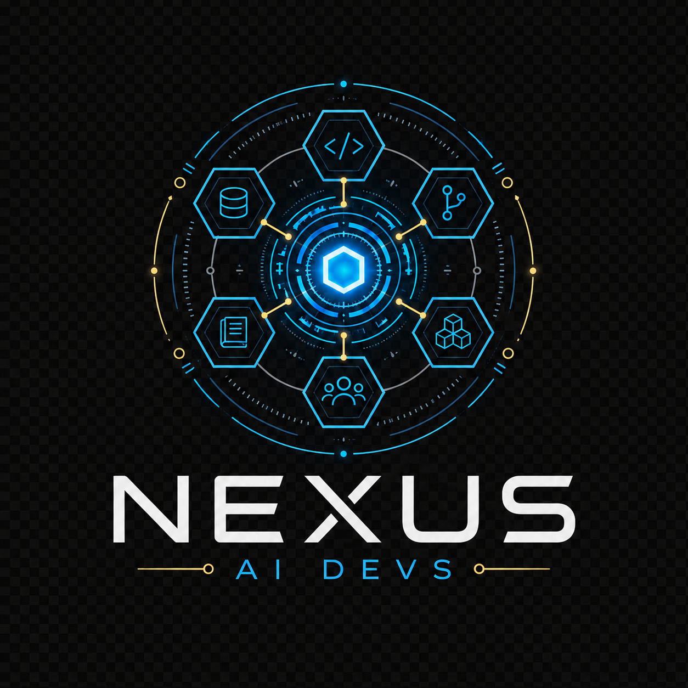

<p align="center">
  
</p>

<h1 align="center">Jarvis Dev</h1>

Jarvis Dev is an open development ecosystem for AI-assisted engineering workflows. It combines a CLI, a local memory daemon, and a central API to help teams keep context, structure execution, and reduce repeated decisions.

## What is included

- **`jarvis-cli/`**: user-facing CLI and workflow entrypoint.
- **`hive-daemon/`**: local service for offline-first memory operations.
- **`hive-api/`**: central API service for shared memory and sync.
- **`hive-dashboard/`**: static admin dashboard source served by `hive-api` when enabled.

## Documentation

- Start here: [`docs/getting-started.md`](docs/getting-started.md)
- CLI reference: [`docs/cli-reference.md`](docs/cli-reference.md)
- Configuration and generated files: [`docs/configuration.md`](docs/configuration.md), [`docs/generated-artifacts.md`](docs/generated-artifacts.md)
- Troubleshooting: [`docs/troubleshooting.md`](docs/troubleshooting.md)
- Architecture reference: [`docs/reference/architecture.md`](docs/reference/architecture.md)
- Security and privacy: [`docs/security-privacy.md`](docs/security-privacy.md)
- SDD user guide: [`docs/sdd-user-guide.md`](docs/sdd-user-guide.md)
- Hive guides: [`docs/hive/local-memory-guide.md`](docs/hive/local-memory-guide.md), [`docs/hive/sync-guide.md`](docs/hive/sync-guide.md), [`docs/hive/api-operator-guide.md`](docs/hive/api-operator-guide.md), [`docs/hive/dashboard-guide.md`](docs/hive/dashboard-guide.md)
- Team adoption: [`docs/teams/adoption-guide.md`](docs/teams/adoption-guide.md), [`docs/teams/evaluator-guide.md`](docs/teams/evaluator-guide.md)
- Public stakeholder docs: [`docs/public/`](docs/public/)

## Core capabilities

- **Shared memory model**
  - Local-first storage with optional central synchronization.
  - Timeline-style observations with `personal` and `project` scopes.
- **Structured SDD workflow**
  - Spec-driven phases (`explore`, `propose`, `spec`, `design`, `tasks`, `apply`, `verify`, `archive`).
- **Context-aware project detection**
  - Detects stack and project metadata for better defaults and skill selection.
- **Persona + skill system**
  - Configurable communication/workflow presets and reusable skill packs.

## High-level architecture

```text
jarvis (CLI)
   |
   +--> hive-daemon (local SQLite, offline-first)
   |
   +--> hive-api (central service, PostgreSQL)
```

The CLI can operate with local memory only, or with a hybrid local+central setup.

## Quickstart (development)

### 1) Start API dependencies

```bash
docker compose -f hive-api/deploy/docker-compose.yml up -d
```

The same Compose stack can build and serve the optional Hive API dashboard at `/dashboard`; see [`docs/hive-api-dashboard.md`](docs/hive-api-dashboard.md).

### 2) Run services locally

```bash
go run ./cmd/server
```

from `hive-api/`, and:

```bash
go run ./cmd/hive-daemon
```

from `hive-daemon/`.

### 3) Run CLI

```bash
go run ./cmd/jarvis --help
```

from `jarvis-cli/`.

## Installation

### Public installer (latest production release)

Linux/macOS:

```bash
curl -sSL https://raw.githubusercontent.com/Thrasno/jarvis-ai-devs/master/scripts/install.sh | bash
```

Windows (PowerShell):

```powershell
irm https://raw.githubusercontent.com/Thrasno/jarvis-ai-devs/master/scripts/install.ps1 | iex
```

Optional overrides:

- `JARVIS_INSTALL_REPO=owner/repo` to fetch artifacts from another repository.
- `JARVIS_INSTALL_VERSION=vX.Y.Z` to force a specific release tag (skip `releases/latest`).
- `JARVIS_INSTALL_VERSION=beta` to install the current public beta prerelease.

Beta examples:

```bash
export JARVIS_INSTALL_VERSION=beta
curl -sSL https://raw.githubusercontent.com/Thrasno/jarvis-ai-devs/master/scripts/install.sh | bash
```

```powershell
$env:JARVIS_INSTALL_VERSION = "beta"
irm https://raw.githubusercontent.com/Thrasno/jarvis-ai-devs/master/scripts/install.ps1 | iex
```

If no public releases are published yet, installer scripts will fail fast with explicit guidance. They also retry transient GitHub/CDN 5xx/429 failures with backoff and validate artifact content before extraction to avoid HTML/error-page unpack attempts. In that case, use the from-source path below.

### From source

Build each binary from its module:

- `jarvis-cli/cmd/jarvis`
- `hive-daemon/cmd/hive-daemon`
- `hive-api/cmd/server`

### Release artifacts

The repository includes `.goreleaser.yaml` to package multi-platform binaries for the main CLI and daemon components. Linux artifacts are validated across modules; Windows CI validates the CLI and PowerShell syntax. macOS artifacts are best effort from GoReleaser.

### Release rollout and reconfiguration

Every Jarvis release is a complete ecosystem pack. A rollout is valid only when the release is announced, applied through the normal release channel, and then reconfigured locally from the new embedded assets.

1. **Announce the release**: publish the release notice in an explicit team channel (physical notice, Teams, mailing list, or equivalent) before treating rollout as started.
2. **Apply the release through the normal install/update channel**: use the release scripts or the team-approved package channel. The channel must install or update the full pack: `jarvis` + `hive-daemon` + version-matched embedded assets.
3. **Reapply managed configuration**: after the update finishes, run `jarvis sync` to replay exactly what this machine already recorded, or rerun `jarvis` when you want the wizard so you can change your answers.

Do not use or document nonexistent release commands such as `jarvis update`, `jarvis upgrade`, or `jarvis setup`. Release rollout governs ecosystem installation and reconfiguration only; Hive ↔ Hive API sync remains a separate product behavior.

`jarvis sync` is non-interactive and takes no flags. It replays the manifest at `~/.jarvis/state.yaml` against the installed version's embedded assets: model assignments, Jarvis-managed MCPs, installer-managed skills, persona, and the statusline when it was enabled at install time. A machine that is already current performs zero writes and says so. See [`docs/cli-reference.md`](docs/cli-reference.md) for the full contract and [`docs/troubleshooting.md`](docs/troubleshooting.md) for its known gaps.

### Single installer contract

After installing binaries (from source or release scripts), the canonical entrypoint is:

```bash
jarvis
```

- First run: launches full setup wizard.
- Re-run: launches reconfiguration wizard with previous values prefilled.
- After an upgrade with no answers to change: `jarvis sync` replays the recorded configuration without prompting.
- Advanced commands (`jarvis persona`, `jarvis login`, `jarvis config`, etc.) remain optional power-user paths.

## Project status

This repository is under active development. APIs, commands, and workflow details may evolve as the platform matures.
