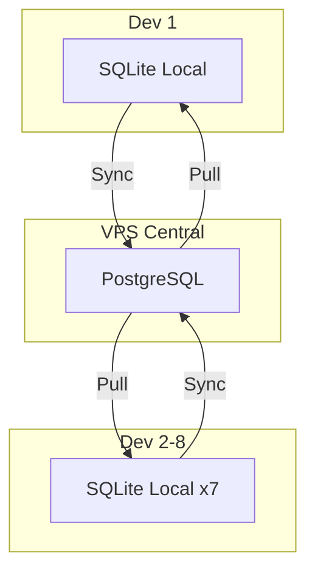

# Análisis Completo: Jarvis-Dev

**Fecha**: 2026-04-09  
**Fase**: Pre-PRD  
**Estado**: Pausado temporalmente

---

## Tabla de Contenidos

1. [Contexto y Motivación](#contexto-y-motivación)
2. [Análisis de Referencia: gentle-ai](#análisis-de-referencia-gentle-ai)
3. [Requerimientos Capturados](#requerimientos-capturados)
4. [Decisiones Arquitectónicas](#decisiones-arquitectónicas)
5. [Diseño de Componentes](#diseño-de-componentes)
6. [Preguntas Pendientes](#preguntas-pendientes)

---

## Contexto y Motivación

### Equipo Conpas

- **Tamaño**: 8 desarrolladores
- **Niveles**: 3 avanzados, 5 en distintos niveles (algunos nunca usaron IA)
- **Stack primario**: Zoho (SaaS), PHP (volumetría alta)
- **Infraestructura**: GitLab self-hosted, 4 VPS (3 PHP apps, 1 GitLab)
- **Auth**: GitLab users + Microsoft SSO (Zoho)
- **Licencias**: Claude Teams (8 seats) compradas por 1 año ✅

### Problemas Identificados

1. **Falta de estandarización**: "Cada uno programa como le da la gana"
2. **QA/Testing débil**: Tests 100% manuales (Zoho SaaS sin runners)
3. **Memoria en silos**: Conocimiento NO compartido, decisiones se pierden
4. **Adopción heterogénea**: 5 devs sin experiencia con IA

### Objetivos del Ecosistema

- Estandarizar uso de IA en el equipo
- Mejorar QA y testing (adaptado a realidad Zoho)
- Compartir memoria cross-team (decisiones, bugs, arquitectura)
- Onboarding progresivo para devs sin experiencia
- Control total del stack (no depender de herramientas externas)

---

## Análisis de Referencia: gentle-ai

**Repositorio**: https://github.com/Gentleman-Programming/gentle-ai

### Arquitectura

- **Lenguaje**: Go 1.24+, Bubbletea TUI
- **Patrón**: Agent adapters (8 agentes, interfaz común)
- **Testing**: 26 test packages, 260+ funciones, 78 E2E tests
- **Distribución**: Homebrew, Scoop, Go install, GitHub Releases

### SDD Workflow (9 fases)

**Grafo de dependencias**:
```
proposal → specs → tasks → apply → verify → archive
             ↓
           design
```

**Modos de artifact store**:
- `engram`: Memoria persistente (upserts sobrescriben)
- `openspec`: Archivos (git history)
- `hybrid`: Ambos (mayor costo de tokens)
- `none`: Efímero

**Características**:
- Invocación orgánica (orchestrator ofrece SDD cuando aplica)
- Strict TDD (auto-detectado si hay test runner)
- Modelos por fase (OpenCode): opus (arquitectura), sonnet (implementación), haiku (archive)

### Skills System

- **Estructura**: YAML frontmatter + markdown
- **Recursos compartidos**: `_shared/` con convenciones
- **Prioridad de carga**: Compact rules → registry → skill path
- **Return envelope**: status, summary, artifacts, next, risks, skill_resolution

### Engram (Memoria Persistente)

- **Implementación**: MCP server (localhost:7437), SQLite + FTS5
- **Topic keys**: Naming determinista (`sdd/{change-name}/{artifact}`)
- **Recovery**: 2 pasos (mem_search → mem_get_observation)
- **Guardado proactivo**: Decisiones, bugs, discoveries, patterns

### PRD Structure (2,366 líneas)

**Secciones**: Problem → Vision → Users → Platforms → Components → UX → Architecture → Success → Non-Goals

**Elementos clave**:
- Tablas (feature matrices, decision trees, requirement tracking)
- Mermaid diagrams (4 en PRD principal)
- "Before/After" storytelling
- Requirement IDs (R-XXX-NN)
- Platform tables (macOS/Linux/Windows)

### Aprendizajes para jarvis-dev

✅ **Usar**: Estructura PRD, tablas, Mermaid, SDD workflow, skills system  
❌ **No usar**: Escala enterprise (8 agentes), Engram como base  
🔄 **Adaptar**: ~800 líneas vs 1,400+, simplicidad para equipo pequeño

---

## Requerimientos Capturados

### 1. Infraestructura y Hosting

**Recursos existentes**:
- 3 VPS (aplicaciones PHP)
- 1 VPS (GitLab self-hosted)

**Decisiones**:
- Memoria compartida: BD centralizada ✅
- Approach: Hybrid local + central (hub-and-spoke) ✅
- Deployment: Pendiente definir (1on1 necesario)

### 2. Autenticación y Permisos

**Auth actual**: GitLab users + Microsoft SSO (Zoho)

**Memoria compartida v1**:
- ✅ SIN roles/permisos complejos (todos ven todo)
- ✅ Tracking de usuario: `created_by`, `updated_by`
- 🔲 Backlog: Sistema de permisos si es necesario en futuro

**Ejemplo de metadata**:
```json
{
  "title": "Sistema de inventario ahora soporta multialmacén",
  "created_by": "andres",
  "created_at": "2026-04-09T19:15:00Z"
}
```

### 3. GitLab y Code Review

**Realidad**:
- GitLab usado como backup/versionado (NO CI/CD activo)
- Zoho es SaaS sin ejecución local
- Tests 100% manuales (NO test runners)

**Decisión**:
- ❌ GGA descartado (no aplica para Zoho)
- ✅ Nueva fase `sdd-qa` con Manual QA Protocol

### 4. Onboarding Progresivo

**Objetivo**: Ecosistema hace onboarding automático

**Mecánica**:
- Nivel 1 (Beginner): Tareas pequeñas (0-10 completadas)
- Nivel 2 (Intermediate): Tareas medianas (11-30 completadas)
- Nivel 3 (Advanced): Sin restricciones (30+ completadas)

**Migración**: Obligatoria cuando esté ready (opt-out para quien NO quiera IA)

**Métricas**: Backlog para futuro (NO v1)

### 5. QA y Testing

**Realidad**: NO test runners (Zoho SaaS)

**Flujo deseado**:
1. IA revisa código generado
2. IA propone mejoras (si las hay)
3. IA genera checklist de pruebas MANUALES
   - Inputs de ejemplo
   - Pasos detallados
   - Resultados esperados
   - Edge cases
4. Usuario ejecuta pruebas en Zoho
5. Usuario confirma pass/fail
6. **BLOQUEANTE**: No se puede archive sin confirmación

**Integración SDD**: Fase `sdd-qa` obligatoria (NO se salta con fast-forward)

### 6. Prioridades (Ordenadas)

1. **A (CRÍTICO)**: Memoria compartida cross-team funcionando YA
2. **C (IMPORTANTE)**: QA/testing manual mejorado (checklist + bloqueante)
3. **B (DESEABLE)**: Estandarización de código (linters, formatters)

### 7. Sistema de Persona

**Arquitectura de 2 capas**:

**Layer 1 (Base Inmutable)**:
- Comportamiento (SDD workflow, delegación)
- Expertise (Zoho, PHP, arquitectura)
- Skills disponibles
- Workflow rules (QA obligatorio, etc.)
- **Definido por Conpas, NO editable por usuarios**

**Layer 2 (User Preset)**:
- Tono, idioma, estilo
- Analogías preferidas
- Nivel de explicación
- **Editable por usuarios con validación**

**Presets**: X cantidad (por definir) + opción Custom

**Validación Custom**:
- ✅ Estructura MD correcta
- ✅ No toca secciones Layer 1
- ✅ Solo modifica secciones Layer 2
- Si válido → se aplica

---

## Decisiones Arquitectónicas

### 1. NO Usar Engram de Base

**Decisión**: Desarrollar sistema de memoria propio desde cero

**Razón**: "No tenemos tiempo para esto, hagámoslo bien" (control total del stack)

**Implicación**: Diseñar arquitectura, API, storage, sync desde cero

### 2. Arquitectura de Memoria: Hybrid Local + Central

**Modelo**: Hub-and-spoke



**Componentes**:

**A) Local (cada dev)**:
- SQLite en `~/.jarvis/memories.db`
- Scopes: `personal` (solo local) + `project` (sincroniza)
- Offline-first, lectura rápida

**B) Central (VPS)**:
- PostgreSQL 15+ en VPS
- Solo almacena `scope: project`
- Full-text search: `tsvector` + GIN index
- Auth: JWT con GitLab tokens

**C) Sync Service**:
- Manual en v1: tool MCP `mem_sync`
- `jarvis sync`: comando informativo/no-op (no ejecuta push/pull)
- Auto-sync: opcional vía `~/.jarvis/sync.json` (`auto_sync: true`)

**Ventajas**:
- Offline-first (dev trabaja sin internet)
- Performance (lectura local rápida)
- Resiliencia (si central cae, devs siguen trabajando)
- Auditoría (historial completo de cambios)

### 3. Guardado Automático (100% Proactivo)

**Decisión**: IA decide AUTOMÁTICAMENTE qué guardar, usuario NUNCA indica

**Triggers automáticos**:
- Decisión arquitectónica tomada
- Bug resuelto
- Convención establecida
- Feature implementado con approach no obvio
- Gotcha/edge case descubierto
- Configuración importante

**Usuario puede ver después**: `jarvis mem recent`

### 4. API REST Convencional

**Decisión**: Usuario prefiere lenguaje familiar (background PHP/Zoho)

**Endpoints propuestos**:
- `POST /memories` - Guardar memoria
- `GET /memories?project=X&type=Y` - Obtener con filtros
- `GET /memories/search?q=query` - Buscar con FTS
- `POST /sync` - Sincronizar (push + pull)
- `GET /memories/{id}/history` - Historial de revisiones
- `POST /memories/{id}/resolve` - Resolver conflicto

**Tipos de memoria**: decision, bugfix, feature, config, gotcha, convention

**Scopes**: personal, project

### 5. Manual QA Protocol (Fase sdd-qa)

**Nueva fase en SDD**:
```
proposal → spec → design → tasks → apply → QA → verify → archive
```

**Formato**: Markdown checklist

**Ejemplo**:
```markdown
## Test 1: Crear producto en almacén secundario

**Input**:
- Producto: "Laptop HP"
- Almacén: "Bodega Sur"

**Steps**:
1. Ir a Zoho Inventory → Productos → Nuevo
2. Llenar datos del producto
3. En campo "Almacén", seleccionar "Bodega Sur"
4. Guardar

**Expected**:
- Producto aparece SOLO en "Bodega Sur"
- NO aparece en almacén principal

**Edge Cases**:
- ⚠ ¿Qué pasa si seleccionás 2 almacenes a la vez?

**Result**: ☐ PASS  ☐ FAIL  ☐ SKIP  
**Notes**: _________________________________________________
```

**Características**:
- BLOQUEANTE: No se puede archive sin todos PASS
- NO se salta con fast-forward
- Si FAIL → vuelve a `sdd-apply` con detalles

### 6. Onboarding con Niveles Automáticos

**Sistema de 3 niveles**:

| Nivel | Tareas | Restricciones |
|-------|--------|---------------|
| **Beginner** | 0-10 | Solo `complexity: low`, max 3 archivos, NO fast-forward |
| **Intermediate** | 11-30 | Hasta `complexity: medium`, max 8 archivos, fast-forward con warnings |
| **Advanced** | 30+ | Sin restricciones |

**Tracking**: `user-stats/{username}` con:
- Tareas completadas por complejidad
- QA success rate
- Avg task duration
- Timestamps de unlock

**Comando**: `jarvis progress` muestra estado actual y próximo nivel

**Override**: Admin puede elevar nivel manualmente si es necesario

---

## Diseño de Componentes

### 1. Sistema de Memoria

**Stack propuesto** (pendiente decisión):

**Opción A (PHP)**:
- Backend: Laravel 10 (PHP 8.2+)
- CLI: PHP CLI
- Pro: Familiar para equipo
- Contra: Menos performante que Go

**Opción B (Go)**:
- Backend: Gin framework
- CLI: Go (binario portable)
- Pro: Performance, portabilidad
- Contra: Curva de aprendizaje

### 2. Base de Datos

**Central (PostgreSQL)**:
```sql
CREATE TABLE memories (
    id UUID PRIMARY KEY DEFAULT gen_random_uuid(),
    title VARCHAR(255) NOT NULL,
    type VARCHAR(50) NOT NULL,
    scope VARCHAR(20) NOT NULL,
    project VARCHAR(100) NOT NULL,
    content JSONB NOT NULL,
    created_by VARCHAR(100) NOT NULL,
    created_at TIMESTAMP NOT NULL DEFAULT NOW(),
    updated_by VARCHAR(100),
    updated_at TIMESTAMP,
    revision INT NOT NULL DEFAULT 1,
    is_current BOOLEAN NOT NULL DEFAULT true,
    search_vector tsvector
);

CREATE INDEX idx_search ON memories USING GIN (search_vector);
```

**Local (SQLite)**:
```sql
CREATE TABLE memories (
    id TEXT PRIMARY KEY,
    title TEXT NOT NULL,
    type TEXT NOT NULL,
    scope TEXT NOT NULL,
    project TEXT NOT NULL,
    content TEXT NOT NULL,
    created_by TEXT NOT NULL,
    created_at TEXT NOT NULL,
    synced INTEGER DEFAULT 0,
    remote_id TEXT
);
```

### 3. Comandos CLI

```bash
# Buscar en memoria
jarvis mem search "multialmacen"

# Ver memorias recientes
jarvis mem recent --limit 10

# Ver memoria específica
jarvis mem show mem_1234567890

# Sync manual desde el agente (MCP)
mem_sync

# Estado/ayuda del flujo de sync desde CLI
jarvis sync

# Ver progreso de onboarding
jarvis progress

# Ver historial de memoria
jarvis mem history mem_1234567890
```

### 4. Flujo de Sincronización

**Push (Local → Central)**:
1. Dev guarda observation con `scope: project`
2. Local marca como `synced: 0` (pending)
3. Tool `mem_sync` detecta pending
4. POST a `/sync` con memorias pendientes
5. Central guarda con metadata (`created_by`, `synced_at`)
6. Local marca `synced: 1`

**Pull (Central → Local)**:
1. `mem_sync` consulta: "¿Nuevas desde last_sync?"
2. Central responde con memorias nuevas/actualizadas
3. Local inserta/actualiza en SQLite
4. Local actualiza `last_sync` timestamp

**Resolución de conflictos**: Last-write-wins con historial completo

---

## Preguntas Pendientes

### 1. Nombre del Sistema de Memoria

**Opciones propuestas**:

**Metáforas de Conocimiento**:
- **Cortex** (corteza cerebral, procesamiento)
- **Synapse** (conexión neuronal)
- **Nexus** (punto de conexión)
- **Chronicle** (crónica histórica)

**Metáforas de Construcción**:
- **Blueprint** (plano arquitectónico)
- **Ledger** (libro mayor)
- **Vault** (bóveda)

**Directos**:
- **KnowledgeBase** (KB)
- **TeamMem**

**Creativos**:
- **Bitácora** (español, navegación)
- **Grimoire** (libro de hechizos)

**Favorito personal**: **Cortex** (profesional, corto, memorable)

### 2. Stack Tecnológico

**Backend**:
- ¿PHP (Laravel) o Go (Gin)?
- Pro PHP: Familiar para equipo
- Pro Go: Performance, binario portable

**CLI**:
- ¿PHP CLI o Go binary?

### 3. Umbrales de Onboarding

**Propuesta actual**:
- Beginner: 0-10 tareas
- Intermediate: 11-30 tareas
- Advanced: 30+ tareas

**¿Está OK o ajustar?**

### 4. Infraestructura para Central

**Preguntas**:
- ¿RAM/CPU del VPS GitLab?
- ¿Se puede reutilizar ese VPS para PostgreSQL?
- ¿Usan Docker en algún VPS?

---

## Próximos Pasos

1. **Usuario responda pendientes** (nombre, stack, umbrales)
2. **Ejecutar `/sdd-new jarvis-dev-prd`**: PRD completo (~800 líneas)
3. **Fase de diseño**: Arquitectura detallada de componentes
4. **Implementación por MVPs**:
   - MVP 1: Memoria compartida funcionando
   - MVP 2: Fase `sdd-qa` con Manual QA Protocol
   - MVP 3: Onboarding progresivo
   - MVP 4: Sistema de Persona

---

**Última actualización**: 2026-04-09  
**Estado**: Pausado temporalmente por otras tareas
