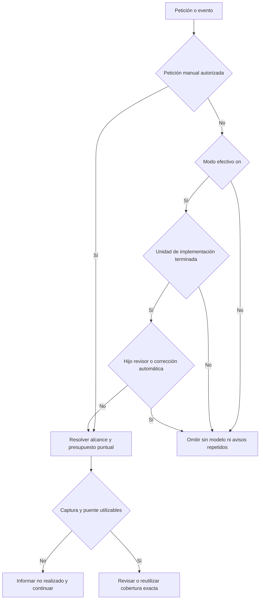
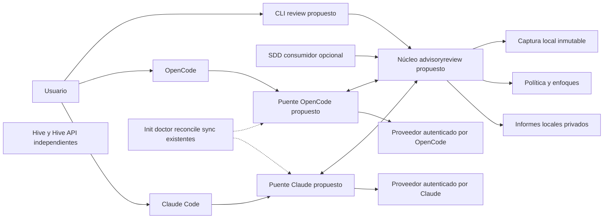
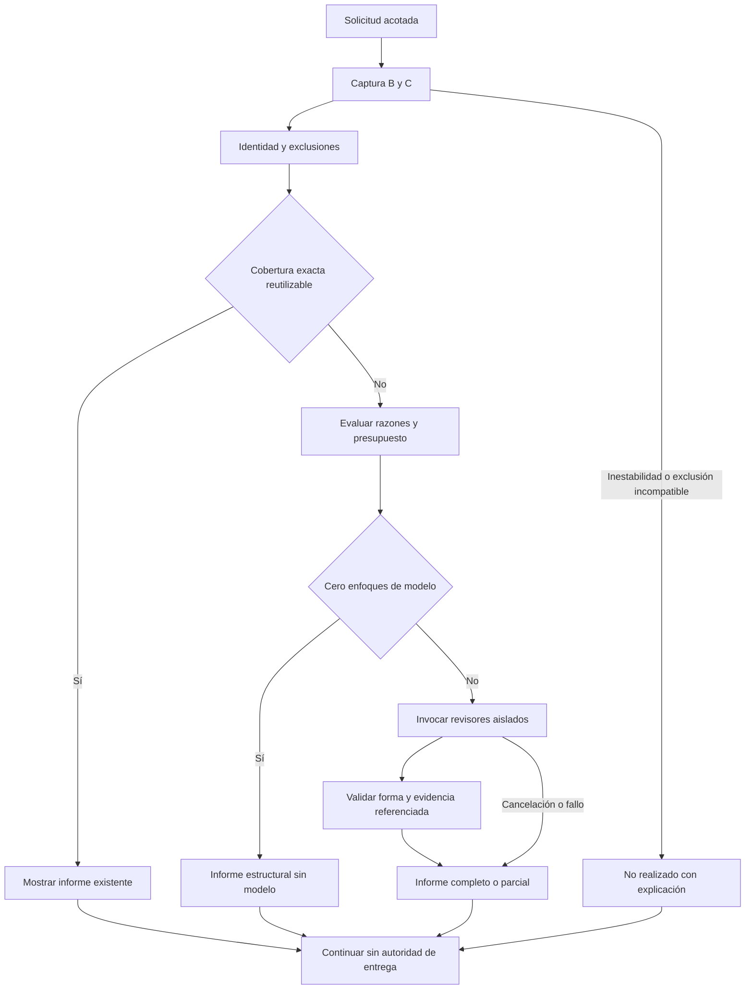
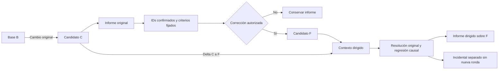
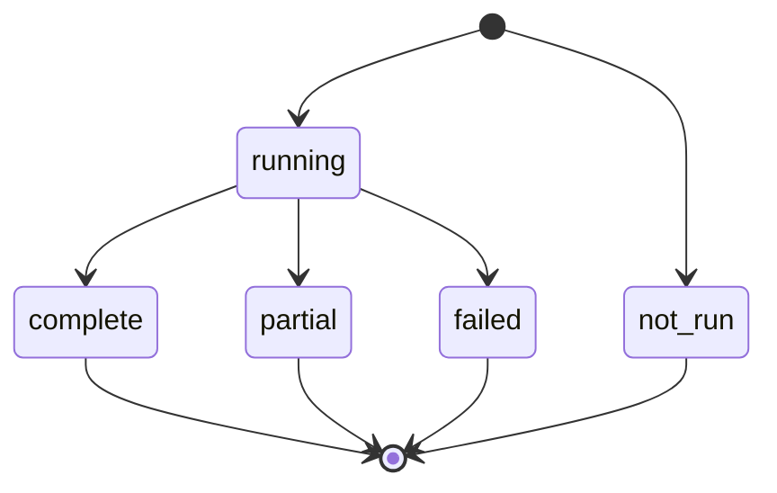

# Auditoría y propuesta de revisión consultiva ligera

> **BORRADOR — NO APROBADO — NO IMPLEMENTADO.** Investigación documental del 8 de septiembre de 2026. Este documento no activa revisiones, no modifica instrucciones operativas y no autoriza implementación, instalación ni cambios de configuración.

## 1. Resultado ejecutivo

**Recomendación:** evaluar un núcleo de revisión consultiva propio de Jarvis, independiente de SDD y de Gentle AI, con evidencia congelada, informes sin autoridad de entrega y transportes para **OpenCode y Claude Code**. La primera entrega útil sería manual en ambos entornos; una fase posterior añadiría activación voluntaria al terminar una unidad de implementación. Ninguna fase debería exigir revisar cada edición ni bloquear edición, commit, push o finalización del agente.

La corrección sería una operación diferente: únicamente ante una petición autorizada, sobre hallazgos confirmados y seleccionados, con criterios fijados antes de editar y una validación dirigida del delta de corrección. Un problema incidental no abriría otra ronda automáticamente. Una regresión realmente causada por la corrección se comunicaría como tal, sin ocultarla ni convertirla en un ciclo de reparación obligatorio.

**No se propone restaurar el RDD retirado.** [El documento de retirada](maintenance/rdd-experiment-retirement.md) excluye el experimento y exige reevaluar cualquier adopción futura. Esta auditoría aporta información para esa decisión, no la sustituye.

| Pregunta | Respuesta propuesta |
|---|---|
| ¿Qué se reutiliza conceptualmente? | Captura inmutable, selección explicada de enfoques, contexto independiente, resultados estructurados y corrección acotada. |
| ¿Qué se elimina? | Recibos de aprobación, refutadores obligatorios, linajes de autoridad, bloqueos de entrega, consumo de autorizaciones y recuperación obligatoria. |
| ¿Cuándo se ejecuta? | Manualmente; opcionalmente al terminar una unidad de implementación, nunca en cada guardado. |
| ¿Qué ocurre si falla? | Informe incompleto o ejecución no realizada; el trabajo y la entrega continúan bajo sus políticas normales. |
| ¿Qué requiere el equipo de pruebas? | Jarvis y el anfitrión correspondiente, ya autenticado. No Gentle AI, Hive, Hive API ni una nueva clave de proveedor exigida por Jarvis. |
| ¿Está probada la compatibilidad? | Hay superficies oficiales y precedentes de código; **no se han ejecutado pruebas reales de los anfitriones en esta auditoría**. |

### Ruta de lectura

1. Decisión de producto: secciones 2–5.
2. Implementación futura e integración: secciones 6–10.
3. Seguridad y prueba de las promesas: secciones 11–13.
4. Coste, decisiones pendientes y fuentes: secciones 14–17.

### Leyenda de evidencia

- **EXISTENTE:** observado en el código local o en el SHA de referencia indicado.
- **DOCUMENTADO:** capacidad descrita por el proveedor; no equivale a ejecución verificada.
- **PROPUESTO:** diseño sujeto a aprobación, sin efecto operativo.
- **PENDIENTE:** hipótesis, decisión o prueba que falta resolver.

## 2. Qué existe y qué problema se está evaluando

### 2.1 Inventario local verificado

Referencia local de la auditoría: `8ca41b28a587efb6dd1eff73e87d30362a2cc5f5`, con árbol de trabajo inicialmente limpio. Las referencias de línea describen esta lectura, no una API estable.

| Superficie existente | Evidencia local | Implicación |
|---|---|---|
| Registro de comandos | `jarvis-cli/cmd/jarvis/main.go:32–35` | Registra `sync`, `sdd`, `hook`, doctor y demás comandos; no registra un comando independiente `review`. |
| Reglas de revisión del orquestador | `jarvis-cli/embed/orchestrator/sdd-orchestrator.md:17–30` | Revisión fresca tras implementación delegada y antes de commit/push/PR, salvo diff trivial de documentación/texto; se formulan como obligaciones. |
| Roles OpenCode | `jarvis-cli/internal/agent/opencode.go:195–267,322–330` | Instala cuatro enfoques; `task` y `edit` denegados, `bash` en `ask`. Eso no es un transporte aislado sobre una captura. |
| Roles Claude | `jarvis-cli/internal/agent/claude.go:449–466` | Instala definiciones de agentes en el directorio generado. |
| Contrato del revisor Claude | `jarvis-cli/embed/agents/claude/review-risk.md:1–38` | Tiene Read/Grep/Glob/Bash y devuelve hallazgos en texto; no es el JSON propuesto aquí. |
| Adaptadores y extensiones | `jarvis-cli/internal/agent/agent.go:81–154` | Ya distingue hooks de memoria y capacidades opcionales de automatización; no conviene ampliar el contrato básico con obligaciones de revisión para todos. |
| Reproducción de configuración | `jarvis-cli/cmd/jarvis/cmd_sync.go:42–63,70–114,132–193` | `jarvis sync` reproduce estado deseado; no sincroniza memorias. |
| Estado deseado | `jarvis-cli/internal/state/state.go:204–220`; `internal/state/lock.go:19–43` dentro de `jarvis-cli` | Escritura atómica y bloqueo de manifiesto de fallo inmediato. No mantenerlo durante una llamada al modelo. |
| Configuración de instalación/nube | `jarvis-cli/internal/config/config.go:26–29,59–77,128–153` | `config.yaml` no es dueño de modelos, agentes ni otros campos de reproducción. |
| Retirada del experimento | `docs/maintenance/rdd-experiment-retirement.md:3–14` | No hay compromiso de reintroducir RDD; Hive y CLI permanecen independientes. |

**Conclusión limitada:** hay instrucciones y roles reutilizables como conocimiento, pero no se ha identificado una canalización independiente instalada de modo/captura/riesgo/informe consultivo. Instalar un agente no demuestra que el anfitrión lo invoque, que reciba los bytes correctos ni que su resultado llegue al usuario.

La combinación de instrucciones obligatorias y roles disponibles es un mecanismo **plausible** de las revisiones observadas en el equipo de pruebas. No se dispone de una traza de esa sesión ni de reproducción controlada: no se atribuye causalidad exacta a una línea, versión o instalación externa.

### 2.2 Clases raíz, no una lista de síntomas

| Clase | Riesgo sistémico | Respuesta de diseño propuesta |
|---|---|---|
| Mezclar información con autorización | Un informe ausente o antiguo impide trabajar. | Ningún consumidor obtiene permiso de entrega del informe. |
| Disparar por operaciones pequeñas | Guardados, herramientas y fases duplican revisores y costes. | Frontera de unidad de trabajo explícita y deduplicación común. |
| Confundir cambios con autoría | Se revisa o corrige trabajo previo de otra persona. | Alcance declarado, captura inicial y advertencia de autoría desconocida. |
| Confundir contexto nuevo con aislamiento | El revisor hereda instrucciones o lee archivos vivos distintos. | Paquete inmutable y capacidades restringidas, probado en cada anfitrión. |
| Corregir ampliando la pregunta | Cada validación descubre otra tarea y nunca termina. | IDs y criterios congelados; delta causal; una ronda automática autorizada. |

Clasificación de esta petición: evaluación de una capacidad nueva y aclaración de mecanismos. No es cierre de un incidente reproducido ni triage de issues individuales.

## 3. Lectura de Gentle AI: conservar mecanismos, no autoridad

### 3.1 Referencias separadas

- **Base publicada:** v2.6.0, `c24a724a1fc109a0cd488e0562feff916a41a7a9` — fuente principal de los comportamientos siguientes.
- **Muestra posterior de main:** `3b3ca3d32bb3b7d40eac67292a87145120ffe343` — comparación de GitHub verificada: 163 commits por delante y ninguno por detrás. No se utiliza como si fuera v2.6.0 ni como el main actual.
- **Documentación de anfitriones:** consultada el 2026-09-08; páginas móviles, sin una versión instalada certificada.

### 3.2 Comportamientos de la base publicada

| Mecanismo | Evidencia | Qué aporta / qué no trasladar |
|---|---|---|
| Selección 0/1/4 | `ClassifyRisk`, `SelectReviewLenses` en [G1] | 0 para material pasivo probado por bytes/modos; 1 para riesgo ordinario; 4 para señales nombradas. Las líneas y el número de archivos no seleccionan nivel. |
| Escaneo de procesos | `processBoundaryRiskReasons` en [G1] | Examina archivos cambiados completos en base y candidato. Puede elevar un cambio por código preexistente fuera del hunk. Es una heurística, no demostración de defecto introducido. |
| Modo voluntario | `ResolveRDDMode`, `rddModeStatus` en [G2] | Global on/off, valor inicial off; el clon solo off/inherit, compartido entre worktrees por Git common dir. No copiar generaciones de autoridad, compatibilidad histórica ni CAS de recibos. |
| Validación de entrega no decisoria | `runReviewFacadeValidateNonDeciding` en [G3] | Devuelve unmanaged; no descubre recibos ni deriva candidato para decidir entrega. `allowed:false` tampoco debe reinterpretarse como veto. |
| Hook Stop todavía bloqueante | `runReviewStopHookStop` en [G4] | Para ciertos candidatos no revisados emite `decision:"block"`. No inicia por sí mismo la revisión, pero impide terminar y manda hacer preflight. **No copiarlo.** |
| Puente OpenCode | [G5] | Intercepta Task, materializa contexto mediante Go, registra propietario/nonce, deduplica instancias y transforma el sistema del hijo. No basta instalar cuatro Markdown. |
| Proceso Claude aislado | [G6] | Proceso fresco sin herramientas, entrada por stdin, sin persistencia de sesión, directorio vacío y exclusión de settings de usuario/proyecto. Conserva resolución normal de autenticación en lugar de usar `--bare`. |
| Captura | [G7], [G8] | Índice privado, árboles base/candidato, untracked intencionales, modos y borrados. Las renombradas pueden representarse canónicamente como borrado+alta; no se pierde la transformación por no usar detección de rename. |
| Corrección acotada | [G9] | El código documenta la cascada causada por prohibir nuevos tests acompañantes. Admite ciertos nombres y ubicaciones, manteniendo límites nativos. Lite debería justificar alcance causal, no importar esa tabla como detector universal. |

Los enum `payments`, `data_loss` o similares no prueban que haya un detector semántico automático completo para esas categorías. Una extensión Markdown tampoco prueba pasividad: instrucciones de agentes, habilidades y plantillas son entrada ejecutiva para modelos.

**Matiz nuevo importante:** el escáner canónico de razones de [G1] deduplica por código y señal, no por cada ruta. Si Jarvis necesita explicar todos los puntos sensibles, debería conservar el inventario de evidencias separado del resumen, sin afirmar que la primera ruta mostrada es la única.

### 3.3 Riesgos de una copia literal

- Un índice privado protege el índice real, pero [G7] todavía contiene invocaciones `git add -u` y `git add --pathspec-from-file`. No es prueba de que toda captura sea inmune a filtros/configuración ejecutable. La inspección congelada sí deshabilita diff externo/textconv y aísla configuración en [G8]; son fronteras diferentes.
- La nota de [G6] explica el problema de OAuth con `--bare` para el contexto de ese código. No se generaliza como hecho eterno de todas las versiones de Claude. La CLI oficial actual describe `--bare` y la autenticación por separado: hace falta verificar la combinación soportada.
- El transporte OpenCode depende de `experimental.chat.system.transform` y de formas de eventos; incluye una compatibilidad comentada para OpenCode v1.18.10. Esa versión del comentario no certifica compatibilidad con la documentación actual.
- La ausencia de bloqueo en `review validate` no demuestra que todos los hooks, prompts y consumidores sean no bloqueantes: [G4] es un contraejemplo concreto.
- La licencia MIT [G12] exige conservar copyright y permiso al copiar porciones sustanciales. Cada dependencia y activo copiado requiere su propia comprobación; no se presume una licencia uniforme del árbol completo.

## 4. Contrato de producto propuesto

### 4.1 Límites simples

1. La revisión produciría **evidencia y asesoramiento**, nunca `approve`, `deny`, tokens de entrega o un requisito de finalización.
2. El usuario conservaría control sobre activación, transmisión al proveedor, presupuesto y correcciones. `on` no autorizaría editar.
3. Los revisores no ejecutarían comandos Git arbitrarios, tests, scripts del candidato ni escrituras. El núcleo prepararía todo el contexto permitido.
4. Una ejecución incompleta conservaría lo obtenido con sus límites; no abriría automáticamente otra ejecución ni exigiría recuperación.
5. Desactivar impediría nuevos trabajos automáticos y cancelaría los pendientes de envío. Una petición ya enviada puede haber consumido datos y coste; no se prometería revocación retroactiva.
6. La aplicación anfitriona podría terminar antes que el informe. La notificación sería breve y posterior, sin despertar un nuevo turno de implementación.

Las políticas normales de seguridad, consentimiento, tests y CI continuarían existiendo. «No bloqueante» se refiere a este subsistema, no a desactivar permisos del anfitrión o protecciones del repositorio.

### 4.2 Modo y disparador son decisiones distintas

**Propuesta de valor inicial:** automatización off y revisión manual disponible como petición puntual. Cuando esté disponible la fase automática, activar `on` significaría exactamente: una revisión consultiva asíncrona por unidad de implementación elegible terminada, dentro del presupuesto comunicado al activar. No habría que encontrar una segunda bandera oculta para que `on` hiciera algo.

| Fuente propuesta | Valores | Precedencia y propiedad |
|---|---|---|
| Global del usuario | `on`, `off`; ausencia = off | Control local de automatización, no impuesto por un repositorio descargado. |
| Clon local | `off`, `inherit`; ausencia = inherit | `off` desactiva; `inherit` consulta el global. Compartido entre worktrees del clon. |
| Petición manual | `run` explícito | Una ejecución puntual, no modifica modo ni habilita otras revisiones. |
| Configuración versionada del proyecto | No controla on/off | Podría describir alcance/rutas sensibles; nunca activar gasto ni transmitir contenido por sí sola. |

Se evaluó permitir `on` por clon: facilita activar solo un proyecto, pero complica el significado del apagado global. Recomendación inicial: off/inherit como upstream. Si se desea activación positiva por proyecto, sería una decisión expresa adicional con tabla de precedencias, no una interpretación silenciosa de `inherit`.

**Manual estando off:** se recomienda admitir una petición directa del usuario y registrar `trigger:"manual"`, `effective_mode:"off"`. Una invocación generada por un hook o por «autorrevisión al terminar» no contaría como petición directa. La CLI no puede demostrar por sí sola el origen humano: el puente transportaría el identificador de petición y las pruebas comprobarían que la automatización no cambia su etiqueta para eludir off.

Alternativa legítima: off absoluto, incluida revisión manual, con autorización puntual explícita. Es más fuerte como interruptor total, pero añade fricción. Esta distinción debería aparecer en el nombre y ayuda del modo antes de aprobarlo. Si el usuario prohíbe revisiones expresamente en una conversación, esa prohibición prevalecería aunque el manual sea técnicamente posible.



Sin Mermaid: manual autorizado entra por alcance/presupuesto; automático exige on y fin de unidad, excluye revisores y correcciones; un fallo de captura o transporte informa, no detiene al usuario.

## 5. Ventanas de ejecución e integración con SDD

| Ventana | Comportamiento recomendado | Motivo / cobertura |
|---|---|---|
| Petición manual en conversación | Disponible en ambos anfitriones, sin SDD | El usuario elige cuándo invertir atención y coste. |
| CLI manual desde terminal | Captura y transporte verificado; sin puente utilizable, `not_run` | Una shell no dispone de la herramienta Task de otra conversación. |
| Fin de implementación directa | Opt-in on: encolar una vez al cerrar unidad con evidencia de cambio | `Stop` o `idle` por sí solos no significan «implementación terminada». |
| SDD apply, fin de lote | Consumidor opcional del mismo núcleo | Una unidad/lote, no cada tarea mínima ni cada archivo. |
| SDD verify | Leer informe compatible o mostrar su ausencia; revisión nueva solo si corresponde a otra petición/unidad | Tests verifican comportamientos; un modelo busca defectos. Ninguno sustituye al otro. |
| SDD archive | No lanzar revisión; conservar referencia informativa si existe | Archivar documentación no requiere reanalizar código. |
| Pre-commit | Sin hook por defecto; manual o consulta local de informe | No introducir coste/modelo en la ruta crítica del commit. |
| Post-commit | Posible integración voluntaria posterior | Frontera estable, pero detecta tarde y no cubre bytes sin commit. |
| Pre-push | Sin hook por defecto; consulta de cobertura del rango explícito | No derivar remotos mediante red ni solicitar credenciales Git. |
| PR | Resumen informativo solicitado, sobre rango explícito | Publicar comentario requiere autorización independiente. |
| CI | Futuro trabajo opcional no requerido | Sin dependencia de sesión local; autenticación y política de datos propias. |
| Edición trivial/guardado | No revisión automática por evento | Cero revisores para pasividad demostrada; manual semántico sigue siendo posible. |
| Corrección de hallazgos | Solo validación dirigida autorizada | Evitar que su Stop vuelva a lanzar las cuatro revisiones. |

### 5.1 SDD sería consumidor, no propietario

El comando propuesto `jarvis review` no requeriría change SDD, preflight, artefactos, memoria ni aprobación de issue. SDD podría aportar objetivo y criterios como contexto declarado, pero no alterar el núcleo ni convertir un informe en `blockedReasons` o autoridad de `nextRecommended`.

La integración futura tendría que reconciliar explícitamente las obligaciones actuales de `sdd-orchestrator.md:17–30` con el modo consultivo. Añadir un switch al CLI dejando instrucciones que exigen revisión fresca mantendría la fricción. Se propone cambiar **las fuentes distribuidas** tras una aprobación futura, no parchear el `CLAUDE.md` o `opencode.json` del equipo de pruebas. Esta auditoría no cambia ninguna de ellas.

En verify, un test fallido podría seguir afectando la verificación SDD conforme a su contrato existente. Un informe de modelo ausente, fallido, incompleto o con hallazgos no añadiría un nuevo bloqueo. La finalización de una fase no esperaría a la red de revisión.

### 5.2 Sin una cadena de cuatro revisiones del mismo trabajo

La clave de reutilización propuesta combinaría: identidad del clon/worktree, base, candidato, proyección, rutas y exclusiones, contexto entregado, versión de política, enfoques, proveedor/modelo resuelto, prompt y motor. El identificador de unidad serviría para colapsar eventos; no sustituiría identidad de contenido.

- Apply y verify con la misma evidencia/cobertura compartirían informe.
- Un commit que solo mueve los mismos bytes a una revisión Git podría conservar cobertura de contenido si se prueba equivalencia; no se supondría por el nombre de rama.
- Un push con más commits tendría otra cobertura; no heredaría una revisión de solo staged.
- Las ejecuciones manuales repetidas podrían devolver el informe exacto existente con aviso; una petición explícita de nuevo análisis tendría un nuevo run y coste.
- Una respuesta incompleta no sería una caché completa ni desencadenaría reintentos ilimitados.

## 6. Arquitectura propuesta y fronteras locales



Sin Mermaid: CLI, SDD y los dos puentes comparten captura/política/informes. El proveedor se invoca mediante el anfitrión. Hive no participa en el circuito. Las líneas discontinuas son instalación y diagnóstico futuros, no una dependencia de revisión en cada sync.

### 6.1 Mapa de implementación futura, no archivos existentes

| Ubicación propuesta | Responsabilidad | Punto existente de integración |
|---|---|---|
| `jarvis-cli/cmd/jarvis/cmd_review.go` | Parseo de comandos, proyección y códigos de salida | Registro de `rootCmd` en `main.go:35`; no en `sddCmd`. |
| `jarvis-cli/internal/advisoryreview/` | Solicitud, captura, riesgo, cobertura, informe, corrección dirigida | Paquete nuevo cohesivo, independiente de Hive y sddstatus. |
| `jarvis-cli/internal/advisoryreview/transport/` | Contrato de invocación/cancelación y adaptadores | Separar ejecución runtime de los instaladores en `internal/agent/`. |
| `jarvis-cli/embed/hooks/` | Activos de puentes específicos del anfitrión | Extender render/merge e inventario de activos gestionados, no copiar manualmente a HOME. |
| `jarvis-cli/embed/agents/claude/` y plantillas OpenCode | Rol consultivo y permisos realmente restringidos | Revisar roles existentes sin asumir que el texto sustituye aislamiento. |
| `jarvis-cli/internal/sddruntime/` | Solo renderizado/validación de integración fina si procede | No convertirlo en propietario del motor de revisión independiente. |

Interfaces mínimas propuestas: `Capture(request)`, `Assess(snapshot)`, `Review(context, invocation)`, `Store(report)`, `ValidateCorrection(plan, delta)`. No se propone un framework general de gobierno, un bus distribuido ni un servidor de memoria obligatorio.

### 6.2 Estado, configuración y bloqueos

**Propuesta preferida:** el estado global de automatización, si forma parte del comportamiento que instalación/sync reproducen, pertenecería a `state.yaml` mediante extensión explícita de su esquema, validadores y proyectores. No se añadiría un campo RDD a `config.yaml`. Informes y trabajos efímeros tendrían almacenamiento privado independiente, por ejemplo `~/.jarvis/review-reports/` (**ruta propuesta**).

El override del clon podría vivir en `<git-common-dir>/jarvis/advisory-review-mode.json` (**ruta propuesta**, no versionada). La clave de informe incluiría además el worktree, porque compartir interruptor no significa compartir candidato. Un fallo del almacén de informes no impediría apagar la automatización; no se anidaría el interruptor bajo el almacén que debe poder desactivar.

Bloqueos cortos y separados: leer/escribir modo o registrar deduplicación; liberar antes de capturar ampliamente o invocar red. No adquirir el lock de manifiesto desde una escritura de informe. Sin bucles de espera por locks para poder continuar trabajando.

**Advertencia comprobada con matiz:** `cmd_sync.go:132–136` y AGENTS documentan que `config.Save` en replay puede volver a entrar en el lock de manifiesto. La implementación actual de `config.Save` leída en `config.go:128–153` muestra escritura de configuración, no ese bridge histórico dentro de la función. Por tanto, se conserva la frontera «no llamar `config.Save` en sync» como contrato del repositorio, sin afirmar que se haya reproducido un deadlock actual. `WithLock` falla inmediatamente cuando está ocupado: una reentrada también puede manifestarse como error, no espera infinita.

### 6.3 Implicaciones del ciclo de instalación

| Flujo existente | Extensión propuesta | Lo que no haría |
|---|---|---|
| Init/reconfiguración | Instalar activos propios y explicar off, presupuesto y capacidades de cada host | No activar por detectar un agente ni lanzar un modelo para «probar». |
| Doctor | Distinguir activo instalado, versión compatible, puente alcanzable y autenticación disponible; diagnóstico sin prompt | No declarar E2E aprobado por encontrar un archivo. |
| Reconcile | Reparar deriva solo de activos gestionados, respetando propiedad y claves ajenas | No modificar decisiones de modo por conveniencia ni tocar informes. |
| Sync | Reproducir estado deseado y activos, sin flags nuevos ni preguntas | No ejecutar revisión, no `config.Save`, no sincronizar memoria ni transmitir candidatos. |
| Actualización/desinstalación | Retirar solo hooks/plugins identificados como propios; conservar decisión off | No borrar hooks del usuario, credenciales ni históricos sin petición. |

Una extensión del manifiesto añade coste de migración y rollback. Alternativa: fichero de preferencias separado si se decide que el modo no es reproducible. Requeriría justificar su propiedad y evitar dos fuentes; no se recomienda decidirlo solo porque resulte más fácil serializar un booleano.

## 7. Compatibilidad real: OpenCode y Claude Code

### 7.1 Matriz de capacidades y trampas

| Capacidad | OpenCode, documentado | Claude Code, documentado | Contrato mínimo propuesto |
|---|---|---|---|
| Observar herramientas | Plugins `tool.execute.before/after` [H1] | `PreToolUse`, `PostToolUse`, `PostToolUseFailure` [H3] | Observar metadatos, no bloquear comandos ni revisar cada llamada. |
| Observar edición | `file.edited`, watcher [H1] | `PostToolUse` sobre Edit/Write; eventos adicionales dependen de versión [H3] | Marcar unidad como cambiada; no lanzar modelo por guardado. |
| Fin de respuesta | `session.idle`, `session.status` [H1] | `Stop`, `SubagentStop` [H3] | Filtrar por identidad de unidad, rol y cambios; no interpretar toda inactividad como tarea terminada. |
| Lanzar revisión | Task desde orquestación; SDK `session.create/prompt` [H2] | `Agent` desde conversación o proceso `claude -p` [H4,H5] | Evidencia fija y contexto independiente, misma semántica de informe. |
| Permisos | Plugins pueden lanzar shell y alterar argumentos; `ask` no es aislamiento [H1] | `tools` restringe disponibilidad; `allowedTools` evita prompts, no define aislamiento [H4,H5] | Sin Bash/edición/MCP general en revisores; inspector cerrado opcional. |
| Cancelación | SDK `session.abort` [H2] | Control del proceso propio; límites del subagente según versión [H4,H5] | Cancelar solo el revisor, recoger parcial y limpiar sin tocar sesión autora. |
| Entrega asíncrona | Eventos/SDK/notificaciones [H1,H2] | Hook de comando `async:true`; salida en próximo turno [H3] | Notificar sin exigir otro turno, ni `decision:block`, ni `asyncRewake`. |
| Autenticación | Proveedor resuelto en la instancia existente | Login del CLI, incluida suscripción compatible [H5] | Jarvis no exige claves nuevas ni copia secretos. Si falta sesión válida, informa indisponibilidad. |
| Aislamiento de contexto | El SDK sigue leyendo `opencode.json`; una sesión nueva no prueba sistema limpio [H2,G5] | Subagente con contexto propio puede cargar CLAUDE.md y settings/hooks; fork hereda conversación [H4] | Probar ausencia de instrucciones autoras, memoria y archivos vivos no enviados. |

**Descubrimiento de versión:** Context7 devolvió también APIs de `dev/specs/v2` de OpenCode (`sessions.interrupt`) mientras la web oficial expone `session.abort`. No se mezclan ambos contratos. Antes de implementar, se fijarían versiones de host/SDK y se compilaría/probaría contra sus tipos y comportamiento reales. Incluso la página SDK alterna `format` en ejemplos y `outputFormat` en su tabla: este borrador no impone ese detalle de API.

En Claude, la documentación indica que Task pasó a llamarse **Agent** en v2.1.63 y conserva alias. Un matcher `Task` no se supondría válido para todos los eventos/versiones solo porque exista un alias en configuración. También advierte que campos `hooks`, `mcpServers` y `permissionMode` se ignoran en agentes distribuidos como plugin. Una definición instalada como archivo y un agente de plugin no son intercambiables sin pruebas.

### 7.2 El puente que una CLI no puede omitir

Un proceso Go iniciado desde Bash no puede llamar directamente a la herramienta conversacional Task/Agent del padre. Hay tres mecanismos posibles, con costes distintos:

| Mecanismo | Ventaja | Coste / límite |
|---|---|---|
| Orquestación nativa desde la conversación | Reutiliza autenticación y UI del host | Depende de routing del agente y de un puente que vincule captura y resultado; no funciona por magia desde shell. |
| Plugin/SDK conectado al host | Control programático del lanzamiento, cancelación y resultado | Versionado, aislamiento, autenticación del canal y prevención de duplicados. |
| Proceso fresco del CLI anfitrión | Frontera explícita y utilizable desde terminal | Latencia de arranque y verificación de settings/auth; no es «el Task de la sesión actual». |

Recomendación: interfaz Go común; OpenCode mediante puente plugin/SDK verificado, con Task como ruta de conversación cuando corresponda; Claude mediante proceso fresco tool-free como ruta inicial y adaptador de eventos opcional. Paridad significa mismas garantías y resultados, no idéntico mecanismo interno.

La vía manual desde terminal en OpenCode necesitaría endpoint local verificado o arranque aislado expresamente soportado. Si no existe, `not_run` con razón `bridge_unavailable` y explicación para solicitarlo desde una sesión compatible. No se iniciaría otra sesión con contexto heredado como fallback silencioso.

### 7.3 Secuencia de integración propuesta

```mermaid
sequenceDiagram
    participant U as Usuario o frontera autorizada
    participant H as Host
    participant P as Puente
    participant C as Núcleo Go
    participant R as Revisor aislado
    U->>H: Solicitar revisión o finalizar unidad opt-in
    H->>P: Solicitud con identidad de unidad
    P->>C: Resolver modo, alcance y presupuesto
    C->>C: Congelar B y C; calcular cobertura
    C-->>P: Invocación acotada e identidad
    alt OpenCode
        P->>H: Crear sesión aislada o vincular Task explícito
        H->>R: Prompt y datos congelados
    else Claude Code
        P->>R: Proceso fresco del CLI; stdin; sin herramientas
    end
    Note over H,P: El autor puede continuar y terminar
    R-->>P: Resultado o salida parcial
    P->>C: Resultado ligado a invocación
    C->>C: Validar esquema y persistir informe
    C-->>H: Notificación informativa sin despertar trabajo
    H-->>U: Cobertura, hallazgos y límites
```

Sin Mermaid: el núcleo congela primero, el host ejecuta después, el informe vuelve vinculado a la misma invocación. El autor nunca necesita esperar para poder entregar o terminar.

### 7.4 Detalles que merecen pruebas, no confianza en el prompt

- OpenCode carga plugins desde varias fuentes, en secuencia; un plugin local y uno npm parecido pueden ejecutarse ambos [H1]. Dedupe de instancias, propietario de invocación y limpieza ante desconexión son requisitos de transporte, no de autoridad.
- El hook `before` puede lanzar excepciones e impedir una herramienta [H1]. La automatización consultiva no lo usaría para interceptar Git ni convertir errores de revisión en errores de herramientas ajenas.
- En Claude, los hooks síncronos esperan; `async:true` evita esa espera pero cada evento crea su propio proceso y no deduplica [H3]. El supervisor necesita sus propios límites, especialmente porque la documentación actual advierte que el timeout de comando async no se aplica como el síncrono.
- `Stop` y `SubagentStop` pueden forzar continuación. Ni `decision:block`, ni salida 2, ni contexto que ordene seguir serían la notificación de lite. Evitar `asyncRewake` incluso si técnicamente no veta Git: vuelve a iniciar actividad.
- Una prueba con ejecutable falso valida argv y stdin, no OAuth, aislamiento real, entrega de notificaciones o cancelación del árbol de procesos.
- La nueva documentación Claude puede rechazar listas de herramientas que no resuelven a ninguna en subagentes. No confundir eso con el contrato del proceso `-p --tools ""` de [G6]; se probarían por separado.

## 8. Captura y selección de revisión

### 8.1 Semántica de alcance propuesta

| Proyección | B: base | C: candidato | Exclusiones explícitas |
|---|---|---|---|
| `staged` | Árbol de HEAD, o vacío para repositorio sin primer commit | Índice copiado sin modificar el real | Cambios solo en workspace; untracked no añadidos al índice. |
| `workspace` | HEAD resuelto una vez | Contenido actual de rutas tracked, altas ya indexadas y untracked seleccionados | Ignorados, secretos y untracked no solicitados. |
| `revisions` | `--base` resuelta a OID exacto | `--candidate` resuelta a OID exacto | Índice y workspace completos. No fetch implícito. |

En `workspace`, las rutas que el índice marca como borradas y los archivos recreados necesitan una definición explícita: el prototipo debería mostrar el manifiesto resultante y distinguir presencia en índice/presencia en disco. No se resolvería mediante `git add -A` en el índice del usuario.

`--paths` limitaría el alcance declarado de cambios; el informe distinguiría esas rutas del contexto adicional. Untracked solo mediante selección literal expresa; nunca «todos los archivos no ignorados». `staged` rechazaría una lista `--include-untracked` no vacía por incompatibilidad, sin añadirlos automáticamente.

Git identifica contenido y relaciones, no autores humanos de hunks sin commit. Una captura inicial de sesión y el registro de herramientas ayudan a atribuir intención; no prueban exclusividad. Con cambios ajenos solapados o escritores concurrentes, la opción segura sería informar alcance incierto y pedir selección en la siguiente petición, no corregirlos automáticamente ni detener la edición.

### 8.2 Captura segura sugerida

1. Resolver raíz, git-dir/common-dir, formato de objetos y revisiones sin red ni inicializar repositorios.
2. Capturar inventario y bytes con límites, rutas literales y política de secretos. No seguir symlinks fuera del alcance.
3. Materializar objetos en almacén privado o manifiesto de bytes con hashes; si se usa Git, evitar filtros y el índice real. Conservar modos, tipo y borrados.
4. Comprobar estabilidad antes/después de la lectura de índice y archivos. No afirmar atomicidad global del workspace: una edición concurrente puede invalidar la captura; devolver `not_run` y no reintentar indefinidamente.
5. Producir identidad canónica de B/C, manifiesto de contexto, exclusiones y proyección. El revisor solo recibe ese paquete, no rutas que pueda volver a leer libremente.

Deshabilitar filtros implica que bytes del workspace pueden diferir de lo que un futuro commit filtrado almacenaría. `capture_representation` distinguiría `raw_workspace` de `git_objects`; no se prometería equivalencia de entrega en repositorios con clean/smudge o normalización. La proyección staged sirve para revisar lo ya indexado sin ejecutar de nuevo esos filtros.

### 8.3 Enfoques y presupuesto

Propuesta inicial inspirada en 0/1/4: 0 modelo cuando se demuestra cambio pasivo; 1 enfoque `reliability` para trabajo ordinario; 4 (`risk`, `readability`, `reliability`, `resilience`) cuando hay señales sensibles explícitas. No son cuatro aprobaciones ni cuatro modelos obligatoriamente diferentes.

Cada selección incluiría razón, ruta, lado B/C, fragmento relevante y si la señal es previa o introducida. Un escaneo completo de archivo podría recomendar un enfoque por contexto previo, pero no etiquetar automáticamente ese contexto como defecto nuevo. La incertidumbre del clasificador no justificaría sobrepasar presupuesto.

Presupuesto provisional para experimentar: máximo 4 invocaciones iniciales, concurrencia 2, 120 segundos por revisor y límite agregado de entrada/salida medido. Son valores de diseño por calibrar, no benchmarks. Sin reintento del modelo por defecto; si el host incluye reintentos de JSON, habría que configurarlos explícitamente y contabilizarlos. La revisión manual permitiría solicitar un enfoque semántico aun cuando el clasificador propusiera cero.



Sin Mermaid: capturar, reutilizar solo cobertura exacta o seleccionar enfoques, validar y publicar; todos los resultados vuelven a información, no a un permiso de entrega.

## 9. Corrección confirmada sin cascadas

### 9.1 Tres objetos, dos preguntas

- **B:** base original.
- **C:** candidato revisado inicialmente; diff original B→C.
- **F:** candidato tras la corrección autorizada; delta de corrección C→F.

La pregunta inicial es «¿qué defectos presenta este cambio?». La pregunta posterior sería «¿C→F resuelve estos IDs según estos criterios y ha roto los comportamientos afectados que hemos comprobado?». No sería una invitación a reevaluar todo B→F con nuevos criterios de estilo.



Sin Mermaid: la autorización selecciona hallazgos del informe sobre C; la validación inspecciona C→F y comportamientos nombrados, y conserva separado lo incidental.

### 9.2 Plan de corrección propuesto

Antes de escribir se fijarían: `report_id`, identidad C, IDs seleccionados, evidencia que los confirma, criterio de resolución por ID, rutas previstas, archivos acompañantes justificados, comprobaciones de regresión, presupuesto y máximo de rondas. Confirmar requiere evidencia/reproducción o razonamiento verificable; no convertir automáticamente toda sugerencia del modelo en defecto confirmado.

El alcance sería **causal**, no únicamente de rutas. Un test nuevo, fixture o ajuste de interfaz requerido puede estar fuera de los archivos originales. Debería estar justificado por el criterio y quedar visible en el plan; si surge una ampliación no prevista, se detendría esa corrección automática para obtener autorización, sin detener el trabajo general ni exigir una revisión completa.

Propuesta: una ronda de edición autorizada y una validación dirigida. Al terminar el presupuesto, informar lo pendiente; no «escalar» a otra maquinaria ni reparar otra vez automáticamente. No se importan porcentajes arbitrarios de líneas como garantía de causalidad. Un pequeño cambio puede ser peligroso y un test amplio puede ser necesario.

### 9.3 Clasificación de resultados dirigida

| Resultado | Evidencia mínima | Tratamiento |
|---|---|---|
| Hallazgo seleccionado resuelto | Criterio fijo satisfecho y comprobación identificada sobre F | Marcar ese ID, no «todo aprobado». |
| Seleccionado no resuelto | Criterio sigue incumplido | Informar; no ampliar criterios ni repetir automáticamente. |
| Regresión causada por corrección | Diferencia demostrable C/F y conexión con C→F; test nombrado cuando sea posible | Separar de incidencias preexistentes; nueva corrección requiere petición. |
| Incidental independiente | No pertenece a IDs ni hay evidencia causal de C→F | Nota separada; no nuevo issue, edición ni revisión automática. |
| Causalidad o cobertura insuficiente | Falta contexto, prueba no ejecutada o dependencia no observada | `unknown`/cobertura parcial, nunca inventar resolución. |

Un test que falla tanto en C como en F no demuestra regresión de la corrección. Un test que pasa en C y falla en F aporta evidencia fuerte, pero necesita controlar entorno/flakiness. La causalidad semántica no es determinista ni puede garantizar «no quedan bugs».

### 9.4 Frescura honesta

El informe original permanece históricamente válido para C. La validación dirigida de F acredita solo IDs seleccionados, C→F y comprobaciones listadas. **No convierte F en un candidato íntegramente revisado.** Reutilizar conclusiones originales exigiría procedencia por cobertura y contexto; de lo contrario se mostraría `full_candidate_reviewed:false`.

Si el workspace ya es distinto de F, el informe no se borra ni se declara corrupto. Se mostraría que no describe los bytes actuales. Capturar nuevamente sería una opción solicitada, no recuperación obligatoria ni un bloqueo para commit/push.

## 10. Interfaz e informes propuestos

### 10.1 CLI ilustrativa — NO IMPLEMENTADA

Estos ejemplos describen una interfaz candidata. **No son comandos disponibles ni instrucciones para ejecutarlos en esta sesión.** Las revisiones nombradas en ejemplos son ilustrativas y se resolverían localmente, nunca mediante fetch automático.

```text
jarvis review mode status --json
jarvis review mode set off --scope global
jarvis review mode set on --scope global
jarvis review mode set off --scope clone
jarvis review mode set inherit --scope clone
jarvis review run --scope staged --host opencode --json
jarvis review run --scope workspace --paths src/cache.go --include-untracked src/cache_test.go --host claude --json
jarvis review run --scope revisions --base main --candidate HEAD --host claude --json
jarvis review show review-42 --json
jarvis review validate-correction --report review-42 --finding F1 --candidate-snapshot snapshot-f --json
```

`validate-correction` sería de lectura y análisis, no aplicaría una corrección. La edición seguiría siendo una tarea autorizada del escritor existente; no hace falta añadir un comando que aplique parches automáticamente para el primer incremento.

### 10.2 Semántica de salida

Propuesta para `run`: código 0 si produce resultado válido, haya o no hallazgos; código 1 para fallo técnico que impide completar la operación solicitada o cancelación; errores de argumentos también no cero con motivo distinto en diagnóstico. No introducir código 2 «hay defectos». La salida JSON, cuando pueda emitirse, distinguiría motivo técnico, cobertura parcial y cancelación; un stderr acotado serviría cuando ni siquiera es posible serializarla.

Los adaptadores automáticos consumirían el diagnóstico sin propagar ese código a herramientas ajenas o finalización del agente. Cualquier hook Git voluntario futuro sería un envoltorio informativo de salida exitosa, no `jarvis review run && git commit` ni `&& git push`. Incluso un hook que siempre devuelve 0 añade latencia si espera al modelo: por eso no se recomienda en el MVP.

### 10.3 JSON ilustrativo — NO IMPLEMENTADO

```json
{
  "schema": "jarvis.advisory-review/v1",
  "report_id": "review-42",
  "run_state": "partial",
  "trigger": "manual",
  "effective_mode": "off",
  "subject": {
    "base_snapshot": "snapshot-b",
    "candidate_snapshot": "snapshot-c",
    "scope": "workspace",
    "capture_representation": "raw_workspace",
    "intended_untracked": ["src/cache_test.go"],
    "authorship": "unknown"
  },
  "identity": {
    "policy": "lite-policy-1",
    "prompt": "review-prompt-1",
    "engine": "prototype-1",
    "context_digest": "example-not-a-real-digest"
  },
  "selection": {
    "lenses": ["reliability"],
    "reasons": [{"code": "ordinary_code_change", "path": "src/cache.go"}]
  },
  "reviewers": [{
    "lens": "reliability",
    "host": "claude",
    "model_requested": "configured-model",
    "model_resolved": null,
    "state": "partial"
  }],
  "findings": [{
    "id": "F1",
    "severity": "warning",
    "status": "unconfirmed",
    "path": "src/cache.go",
    "candidate_lines": [40, 44],
    "claim": "La ruta de cancelación puede dejar un recurso abierto.",
    "evidence": "Referencia ilustrativa al fragmento congelado, no un hallazgo real.",
    "uncertainty": "Falta observar la liberación en el llamador."
  }],
  "coverage": {
    "kind": "initial",
    "reviewed_paths": ["src/cache.go"],
    "full_candidate_reviewed": false,
    "excluded": [{"path": "src/cache_test.go", "reason": "context_budget"}],
    "checks": []
  },
  "diagnostics": [{"code": "context_incomplete", "retry_automatic": false}]
}
```

Los nombres `src/cache.go`, `snapshot-c` y `review-42` son ficticios. Los identificadores de producción se derivarían de manifiestos y contenido, no aceptarían la cadena de ejemplo como hash.

Semántica estable propuesta: campos esenciales obligatorios; colecciones vacías significan «ninguno observado», no «desconocido»; `null` expresa desconocimiento explícito en campos que lo admitan; un campo opcional ausente significa «no aportado», nunca éxito. `schema` versionaría cambios incompatibles. El modelo resuelto debería registrarse siempre que el host lo exponga; si se desconoce, no se reutilizaría bajo una identidad de modelo supuestamente exacta.

Un informe dirigido añadiría `parent_report_id`, `selected_finding_ids`, identidad C/F, criterios congelados, resultados por criterio, regresiones causales y hallazgos incidentales separados. Cada check incluiría nombre, comando autorizado, entorno/candidato, resultado y fuente; `checks:[]` no diría «tests pasados».

### 10.4 Estados del informe, no estados de autoridad



Sin Mermaid: la ejecución puede no realizarse, terminar completa, parcial o fallida. Una cancelación se expresa como motivo de `partial` si hay resultados o `failed` si no los hay. Los hallazgos son otra dimensión; `complete` no significa libre de defectos. Frescura y cobertura tampoco son nuevos estados de autoridad.

Almacenamiento propuesto: informes locales privados, retención inicial de 30 días y límite agregado de tamaño por calibrar; conservar metadata y hallazgos con menos extractos, borrar paquetes de contexto tras la ejecución salvo conservación solicitada. No registrar stdin completo, transcripciones o entorno para depurar por defecto. Borrar localmente no borra registros del proveedor ni transcripciones que el anfitrión haya persistido: esa cobertura de privacidad necesita comprobarse y explicarse antes del opt-in.

## 11. Seguridad y privacidad

| Frontera | Amenaza | Mitigación propuesta y prueba requerida |
|---|---|---|
| Candidato → modelo | Prompt injection en código, docs, nombres o tests | Separar instrucciones confiables de datos; no promover texto del candidato a system; revisor sin herramientas; fixtures con instrucciones adversarias. No prometer inmunidad semántica. |
| Host → contexto | CLAUDE.md, skills, memoria, fork o plugins heredados | Contexto fresco comprobado con marcadores canario; permitir solo invocaciones registradas; no desactivar controles empresariales ajenos. |
| Captura → archivos | Symlink, traversal, archivos especiales, carrera de sustitución | Apertura segura, no-follow donde exista, límites de raíz y tipos, representación del enlace sin seguir destino; abortar captura inestable. |
| Captura → Git | Filtros, diff externo, textconv, fsmonitor, hooks, atributos y helpers | Runner de lectura con argv explícito y entorno reducido; configuración aislada; sin shell construida; fixtures con ejecutables canario que nunca deben ejecutarse. |
| Submódulos | Submodule update, red o contenido externo no declarado | Tratar gitlink como cambio de OID; no inicializar/recorrer/descargar automáticamente. Cobertura interna excluida. |
| Captura → proveedor | Secretos, material privado y untracked ajenos | Exclusiones previas a transmisión, selección expresa y resumen del alcance; no incluir `.env`, claves o credenciales por defecto. Redactar implica cobertura limitada. |
| Puente local | Confundir sesión/clone o inyectar resultados | Canal local autenticado, identidad de invocación, nonce efímero y ownership; validar tamaños/esquema. No exponer endpoint público. |
| Respuesta → informe | JSON malformado, rutas falsas, payload gigante o control de terminal | Parseo estricto de campos críticos, rutas ligadas al manifiesto, escape de salida y límites de bytes. |
| Timeout/cancelación | Hijos huérfanos o reintentos infinitos | Deadline propio, cancelación del árbol de procesos/sesión revisora, salida parcial y cero relanzamientos automáticos. |
| Corrección → ejecución | Test/script malicioso usado como «verificación» | Ejecutor de tests separado del revisor, comandos autorizados y entorno de prueba definido; no ejecutar sugerencias de un modelo sin control. |

**Sin nueva clave obligatoria no significa sin autenticación ni sin coste.** Jarvis delegaría en las credenciales ya gestionadas por el host; no las leería para guardarlas en su configuración o logs. Un proveedor remoto recibe los bytes seleccionados: el opt-in tendría que explicarlo. Offline permite estado, captura y consulta local; revisión de modelo solo si el anfitrión dispone de un proveedor local operativo, no como promesa general.

CodeGraph podría aportar contexto de impacto opcional. Un índice del workspace actual no sustituye evidencia de B/C: sus fragmentos tendrían que verificarse contra los bytes capturados o etiquetarse como contexto no congelado, excluido de conclusiones firmes. La revisión no exigiría CodeGraph, Hive, Engram ni un servicio de red de memoria.

## 12. Estrategia de aceptación futura

**No se han ejecutado estos tests.** Los nombres siguientes son objetivos propuestos, no pruebas existentes ni resultados verdes. La futura implementación debería comenzar por pruebas de comportamiento y escenarios reales de ambos anfitriones.

### 12.1 Contrato compartido

| Test propuesto | Ejecución observable | Aserción principal |
|---|---|---|
| `TestModeOffDoesNotLaunchAutomaticReview` | Eventos de edición, fin de tarea, Stop, apply y verify con off | Cero invocaciones de proveedor, cero activación implícita, sin avisos repetidos. |
| `TestManualRunWhileOffIsOneShot` | Petición manual seguida de eventos automáticos | Una revisión, modo intacto, ningún segundo trabajo. |
| `TestAdvisoryFailureNeverVetoesDelivery` | Fallos de captura, lock y proveedor; ejecutar edición/commit/push en fixture local con remoto bare | Las acciones conservan su resultado normal; no se introduce un veto de revisión. |
| `TestAgentCanFinishBeforeReport` | Revisor artificialmente lento | Finalización visible antes del informe; sin continuación forzada. |
| `TestCandidateCoverageDeduplicatesLifecycleEvents` | Apply→verify→commit→push sobre contenido equivalente y luego rango mayor | Una ejecución para cobertura exacta; sin reutilización indebida para rango mayor. |
| `TestReviewerCannotExecuteCandidateInstructions` | Datos que piden leer secretos, ejecutar Git o delegar | Sin herramientas ni nuevas invocaciones; datos no llegan a instrucciones del sistema. |
| `TestPartialResultDoesNotAutoRetry` | Un enfoque falla, otro termina | Resultado parcial conservado y coste acotado; no segunda oleada. |
| `TestDisableSurvivesBrokenReportStore` | Almacén de informes ilegible | Off puede persistirse sin reparar el almacén; no nuevas llamadas. |

La prueba de Git usaría un fixture aislado y un remoto local, no el repositorio de desarrollo. Que commit/push funcionen no prueba por sí solo que el agente pueda finalizar: son dos pruebas diferentes.

### 12.2 Matriz de fixtures Git

| Familia | Casos mínimos | Evidencia de aceptación |
|---|---|---|
| Proyecciones | Staged, workspace, revisions, staging parcial y archivo modificado en ambos lados | Hash del índice real/HEAD/refs antes y después idéntico; contenidos capturados correctos. |
| Altas y bajas | Untracked seleccionado/no seleccionado/ignorado, intent-to-add, borrado staged con recreación en disco | Inventario explícito; nada ajeno transmitido. |
| Tipos y nombres | Rename, borrado, modos ejecutables, archivo vacío, binario, UTF-8/nombres con espacios y saltos | Manifiesto sin pérdida; binarios sin volcar bytes al modelo; rutas seguras. |
| Repositorios | Sin primer commit, detached HEAD, linked worktree, SHA-1/SHA-256, sparse checkout, conflictos de índice | Semántica soportada explícita o `not_run` explicado, nunca Git init/reparación automática. |
| Configuración adversa | clean/smudge, external diff, textconv, fsmonitor, hooks y atributos | Ningún ejecutable canario invocado; representación de bytes declarada. |
| Límites | Archivo enorme, muchas rutas, symlink, gitlink, temp restringido y escritura concurrente | Sin lectura ilimitada, expansión de scope ni reintento en bucle. |

### 12.3 Correcciones

- `TestCorrectionUsesFrozenSelectedCriteria`: un cambio de estilo incidental no puede alterar el criterio de F1.
- `TestCorrectionAllowsJustifiedCompanionTest`: un test nuevo necesario entra en el plan sin exigir revisión completa.
- `TestCorrectionSeparatesRegressionFromIncidental`: fixtures donde el defecto existe en C/F y donde aparece solo en F; clasificación y ausencia de relanzamiento comprobadas.
- `TestTargetedCoverageDoesNotClaimFullCandidate`: validar F1 no renueva automáticamente el informe completo de C sobre F.
- `TestConcurrentAuthorChangeStopsOnlyCorrection`: una modificación ajena impide escribir encima; no bloquea commit ni obliga a recuperar un linaje.
- `TestUnsupportedVerificationIsUnknown`: check no ejecutable, prueba flaky o contexto insuficiente no se presenta como resuelto.

### 12.4 E2E de anfitriones: condición de paridad

| OpenCode real | Claude Code real | Evidencia que se conservaría |
|---|---|---|
| Carga local/global duplicada; llamada manual; sesión hija; cancelación; cierre antes de resultado | Login de suscripción; proceso fresco; hook async; Agent/Task según versión; cancelación | Versión exacta, forma de llamada, tiempos, número de invocaciones e IDs del candidato. |
| Canarios en instrucciones del padre y plugins; prueba de system transform y retorno de herramientas | Canarios en CLAUDE.md/settings/skills; aislamiento sin `--bare`; comprobar políticas gestionadas | Qué contexto recibió el revisor, sin exponer secretos ni transcripción completa. |
| Puente ausente, server caído, permiso denegado y schema host incompatible | CLI ausente/no autenticado, settings restringidos, salida malformada y timeout | `not_run`/parcial, sin fallback inseguro ni bloqueo de finalización. |

Una prueba Go de presencia/renderizado de agentes **no sustituye** estas pruebas. Tampoco lo hace ejecutar un script que simule la respuesta del host. Se recomienda certificar inicialmente una versión concreta por host en Linux; macOS y Windows/WSL ampliarían después la matriz. **La primera certificación de producto requiere ambos hosts**, aunque sus trabajos puedan desarrollarse en orden.

### 12.5 Evidencia upstream posterior, sin mezclar versiones

En la muestra posterior [G10] se leyó `TestShippedReviewValidatePrePushIgnoresExplicitBaseRefAndNeverTouchesNetwork`: prepara un remoto HTTPS no accesible y exige respuesta no decisoria acotada sin derivar red. También `TestShippedReviewValidateAllGatesIgnoreAuthorityStateWithoutMutation` cubre almacén limpio, revisión activa, recibo histórico, corrupción y residuo de lock.

Son **tests leídos, no ejecutados**. Sus comentarios relacionan el escenario con cambios históricos upstream; no se afirma haber reproducido esos incidentes ni que toda esa cobertura sea exclusiva de main. El árbol fijado [G11] permite localizar pruebas adicionales como `opencode_review_transport_plugin_test.go`, `claude_adapter_test.go` y `frozen_candidate_binary_patch_test.go`; su existencia no certifica los hosts ni Jarvis.

## 13. Prototipos de riesgo antes de estimar con precisión

| Investigación acotada propuesta | Pregunta de salida | Si no funciona |
|---|---|---|
| Puente OpenCode con una versión fijada | ¿Es posible contexto limpio y resultado ligado a C sin bloquear al padre? | Mantener manual desde conversación con cobertura limitada declarada; no anunciar compatibilidad completa. |
| Proceso Claude con OAuth normal | ¿Conserva autenticación sin cargar contexto ajeno y sin herramientas? | Revisar combinación de flags/adaptador; no exigir API key como sustitución silenciosa. |
| Captura sin filtros | ¿Representa staged/workspace y detecta carreras sin ejecutar configuración del repo? | Acotar inicialmente proyecciones soportadas y explicar las excluidas. |
| Notificación asíncrona en ambos | ¿El usuario puede finalizar y ver después el informe sin reactivar el agente? | Solo invocación manual explícita hasta demostrar esa propiedad. |
| Corrección C→F con test nuevo | ¿Conserva criterios y detecta regresión sin revisión total? | Mantener validación dirigida manual, sin automatizar edición. |

Ningún prototipo se ha implementado o ejecutado en esta sesión. Un fallo limitaría la declaración de soporte, no justificaría trasladar autoridad nativa ni introducir un bloqueo.

## 14. Hoja de ruta, dependencias y coste

### 14.1 Paquetes de trabajo propuestos

| Paquete | Entregable | Depende de | Límite de rollback |
|---|---|---|---|
| P0 — prueba de viabilidad | Versiones fijadas, spikes de aislamiento/auth/captura | Decisión de evaluar implementación | Ningún activo de usuario distribuido. |
| P1 — núcleo manual | Captura, política, informe JSON, almacenamiento y CLI independiente | P0 | Retirar comando sin tocar SDD/Hive; históricos siguen legibles. |
| P2 — OpenCode | Puente con cancelación/dedupe y E2E real | P1 | Desinstalar solo plugin gestionado; núcleo sigue disponible. |
| P3 — Claude Code | Proceso fresco, transporte y E2E real | P1 | Retirar adaptador/activos propios sin cambiar autenticación. |
| P4 — paridad e integración | Instalación, doctor, reconcile/sync, pruebas de manifiesto | P2 y P3 | Volver a off y retirar automatización propia; sin migrar memorias. |
| P5 — disparo opcional | Unidad terminada, dedupe, consumidor SDD informativo, prompts coherentes | P4 | Desactivar eventos; manual permanece funcional. |
| P6 — corrección dirigida | Plan fijo C→F, alcance causal y cobertura honesta | P1 y E2E manual de ambos | Retirar automatización de corrección sin perder informes. |
| P7 — endurecimiento | Plataformas adicionales, carreras, carga, retención y observabilidad | P4; P5/P6 si se incluyen | Reducir matriz de soporte con aviso; no reinterpretar informes. |

P2 y P3 son obligaciones de la misma entrega de compatibilidad, no alternativas. Se puede demostrar OpenCode primero internamente, pero eso no satisface el alcance final solicitado.

### 14.2 Estimación orientativa en semanas-persona

| Alcance acumulado | Orden de magnitud | Lectura correcta |
|---|---|---|
| Núcleo/manual y prueba inicial de transporte | 4–7 | Hito técnico, **no** producto compatible con ambos hosts. |
| OpenCode operativo integrado | 7–12 totales | Referencia intermedia heredada de la investigación, no alcance final. |
| Ambos hosts e integración/plataformas más amplias | 11–18 totales | Rango de planificación, sujeto a versiones, aislamiento y matriz acordada. |
| Extensión de corrección dirigida | +2–4 provisionales | Juicio de ingeniería, no medido ni derivado de líneas; puede solaparse con P7 y debe reestimarse tras P6 de prueba. |

Los tres primeros rangos son **acumulados, no sumables**. El adicional de corrección no tiene evidencia empírica suficiente para prometer fecha. Asume una persona con experiencia Go/Git y disponibilidad para los dos hosts, sin nuevo SDK de proveedor, sin backend central, sin migración de recibos y con fixtures ya organizables en el repositorio. Semanas-persona no son semanas de calendario ni una oferta cerrada.

Factores que amplían el rango: API experimental de OpenCode, políticas empresariales de Claude, aislamiento cross-platform, captura con filtros, límites de proceso Windows y alcance de automatización. Reducir el MVP a manual en ambos hosts reduce riesgo de eventos, pero no elimina pruebas de autenticación, contexto y captura. No se estima copiando número de archivos o líneas de Gentle AI.

### 14.3 Prioridades y exclusiones

- **MVP:** manual en ambos hosts, evidencia inmutable, privacidad previa al envío, informes y errores informativos, pruebas reales de transporte, sin dependencia de Gentle AI.
- **Siguiente incremento:** opt-in por unidad y SDD como consumidor fino; coherencia de prompts y reproducción de configuración.
- **Corrección:** validación dirigida primero; escritura automática solo si posteriormente se autoriza y se prueba.
- **Endurecimiento:** plataformas, retención, métricas, rendimiento y matrices de carreras.
- **Excluido:** receipts, refuters obligatorios, approval/burn, delivery gates, ledger de reparación, autoridad RDD, migración de linajes, obligatoriedad de memoria, publicación automática de issues/PR y revisiones en cada guardado.

## 15. Decisiones pendientes con valores recomendados

| Decisión aún no aprobada | Valor recomendado | Compromiso |
|---|---|---|
| ¿Qué significa off? | Automatización off; petición manual puntual admitida | Más útil para uso manual; ayuda y UI deben evitar prometer apagado absoluto. |
| ¿On positivo por clon? | No inicialmente: off/inherit | Simplicidad y apagado global predecible frente a granularidad. |
| ¿Qué hace on? | Revisión asíncrona al fin de unidad elegible, no cada Stop | Requiere metadatos de unidad; sin ellos no se inventa una frontera. |
| ¿Dónde vive el modo global? | `state.yaml` si es estado reproducible | Extensión explícita de esquema y replay; nunca duplicado en config. |
| ¿Número de enfoques? | 0/1/4 explicado, reliability por defecto | Coste adaptativo, pero detector limitado y presupuesto prioritario. |
| ¿Corrección automática? | No en MVP; una ronda autorizada después | Menor riesgo y menos cascadas a cambio de intervención expresa. |
| ¿Versiones/plataformas mínimas? | Un par de versiones fijadas y Linux para ambos primero | Aún sin números certificados; no prometer soporte universal. |
| ¿Retención/presupuesto? | 30 días e invocaciones limitadas como punto de prueba | Valores por calibrar con coste y privacidad reales. |

No se requiere una entrevista adicional para entender esta recomendación. Aprobar el diseño exigiría confirmar estas decisiones y autorizar un trabajo distinto; la redacción no las convierte en reglas vigentes.

## 16. Fuentes y trazabilidad

Todas las consultas de esta ampliación se realizaron el **2026-09-08**. Se utilizó CodeGraph para código local, lectura dirigida para documentación, Context7 antes de documentación oficial y GitHub/API o raw para fuentes fijadas. No se clonó ni instaló Gentle AI.

### 16.1 Fuentes upstream fijadas

| ID | Fuente | Uso / alcance |
|---|---|---|
| G1 | [risk.go — v2.6.0](https://github.com/Gentleman-Programming/gentle-ai/blob/c24a724a1fc109a0cd488e0562feff916a41a7a9/internal/reviewtransaction/risk.go) | Clasificación, enfoques, razones, escaneo B/C y pasividad. |
| G2 | [rdd_mode.go — v2.6.0](https://github.com/Gentleman-Programming/gentle-ai/blob/c24a724a1fc109a0cd488e0562feff916a41a7a9/internal/reviewtransaction/rdd_mode.go) | Global off/on y clon off/inherit; separación del interruptor y autoridad. |
| G3 | [review_facade.go — v2.6.0](https://github.com/Gentleman-Programming/gentle-ai/blob/c24a724a1fc109a0cd488e0562feff916a41a7a9/internal/cli/review_facade.go#L2307) | Validación pública no decisoria; no equivale a ausencia de otros bloqueos. |
| G4 | [review_stop_hook.go — v2.6.0](https://github.com/Gentleman-Programming/gentle-ai/blob/c24a724a1fc109a0cd488e0562feff916a41a7a9/internal/cli/review_stop_hook.go) | `decision:block`, dedupe por sesión/candidato y baseline. |
| G5 | [opencode-review-transport.ts — v2.6.0](https://github.com/Gentleman-Programming/gentle-ai/blob/c24a724a1fc109a0cd488e0562feff916a41a7a9/internal/assets/opencode/plugins/opencode-review-transport.ts) | Task relay, nonce, ownership, duplicados y transformación experimental. |
| G6 | [claude_adapter.go — v2.6.0](https://github.com/Gentleman-Programming/gentle-ai/blob/c24a724a1fc109a0cd488e0562feff916a41a7a9/internal/reviewerprovider/claude_adapter.go) | Proceso fresco, stdin, flags, directorio temporal y comentario de OAuth. |
| G7 | [snapshot.go — v2.6.0](https://github.com/Gentleman-Programming/gentle-ai/blob/c24a724a1fc109a0cd488e0562feff916a41a7a9/internal/reviewtransaction/snapshot.go) | Proyecciones, untracked explícitos, índice privado y llamadas add. Lectura dirigida de esos puntos. |
| G8 | [frozen_candidate_context.go — v2.6.0](https://github.com/Gentleman-Programming/gentle-ai/blob/c24a724a1fc109a0cd488e0562feff916a41a7a9/internal/reviewtransaction/frozen_candidate_context.go) | Manifiesto, aislamiento de inspección y tratamiento de binarios. |
| G9 | [correction_scope.go — v2.6.0](https://github.com/Gentleman-Programming/gentle-ai/blob/c24a724a1fc109a0cd488e0562feff916a41a7a9/internal/reviewtransaction/correction_scope.go) | Explicación y regla acotada de tests acompañantes; no detector universal. |
| G10 | [review_validate_nondeciding_test.go — muestra posterior](https://github.com/Gentleman-Programming/gentle-ai/blob/3b3ca3d32bb3b7d40eac67292a87145120ffe343/internal/cli/review_validate_nondeciding_test.go) | Tests de pre-push sin red y almacenes diversos, leídos no ejecutados. |
| G11 | [Árbol de la muestra posterior](https://github.com/Gentleman-Programming/gentle-ai/tree/3b3ca3d32bb3b7d40eac67292a87145120ffe343) | Inventario de tests y comparación de 163 commits; no comportamiento publicado atribuido a v2.6.0. |
| G12 | [LICENSE — v2.6.0](https://github.com/Gentleman-Programming/gentle-ai/blob/c24a724a1fc109a0cd488e0562feff916a41a7a9/LICENSE) | MIT, copyright y aviso de permiso para porciones sustanciales. |

### 16.2 Documentación oficial de anfitriones, no fijada a una instalación

| ID | Fuente | Qué permite afirmar |
|---|---|---|
| H1 | [OpenCode: plugins](https://opencode.ai/docs/plugins/) | Hooks, eventos, carga múltiple y cliente SDK disponible en plugin. |
| H2 | [OpenCode: SDK](https://opencode.ai/docs/sdk/) | Sesiones, prompt, abort, configuración heredada, errores y structured output. |
| H3 | [Claude Code: hooks](https://code.claude.com/docs/en/hooks) | Stop/SubagentStop, async, códigos/salidas y límites; los defaults pueden cambiar. |
| H4 | [Claude Code: subagentes](https://code.claude.com/docs/en/sub-agents) | Contexto, herramientas, carga de instrucciones, Agent/Task y diferencias de distribución. |
| H5 | [Claude Code: CLI](https://code.claude.com/docs/en/cli-reference) | Print, stdin, flags de herramientas/settings, autenticación y procesos. |

Context7: `/anomalyco/opencode` y `/websites/code_claude`. La primera consulta devolvió material de desarrollo además de APIs publicadas; se contrastó con las páginas oficiales y se mantuvo esa incertidumbre de versión explícita.

### 16.3 Fuentes locales relevantes

- [Retirada de RDD](maintenance/rdd-experiment-retirement.md):3–14 — decisión histórica documentada, no revertida aquí.
- [Registro CLI](../jarvis-cli/cmd/jarvis/main.go):32–42 — entrada y código de salida actuales.
- [Sync](../jarvis-cli/cmd/jarvis/cmd_sync.go):42–63,70–114,132–193 — replay sin datos Hive y frontera de config.
- [Config](../jarvis-cli/internal/config/config.go):26–29,59–77,128–153 — stores disjuntos y matiz del comentario histórico.
- [Lock del manifiesto](../jarvis-cli/internal/state/lock.go):19–43 — adquisición de fallo inmediato.
- [Agentes OpenCode](../jarvis-cli/internal/agent/opencode.go):104–126,195–267,322–330 — deep merge y permisos actuales.
- [Instalador Claude](../jarvis-cli/internal/agent/claude.go):449–466 — roles generados.
- [Interfaces de agente](../jarvis-cli/internal/agent/agent.go):81–154 — hooks y capacidades opcionales.
- [Rol de riesgo Claude](../jarvis-cli/embed/agents/claude/review-risk.md):1–38 — herramientas y salida textual.
- [Orquestador distribuido](../jarvis-cli/embed/orchestrator/sdd-orchestrator.md):17–30 — obligaciones actuales a reevaluar en un cambio futuro.
- [Contrato del repositorio](../AGENTS.md) — fuentes de verdad, no editar configuración generada y separación de sync.

## 17. Verificación de esta auditoría y preparación para decidir

### Qué se ha comprobado

- Código local mediante CodeGraph y documentación local mediante lectura dirigida; registro CLI, roles y frontera de replay inspeccionados.
- Fuentes upstream relevantes fijadas a SHA; comparación de la muestra posterior; documentación oficial consultada después de Context7.
- Documento redactado como propuesta en español, con interfaz ficticia diferenciada de comportamiento existente y explicación textual de cada diagrama.
- Relectura estructural del documento, comprobación de rutas locales referenciadas, fences y coherencia manual de nodos/estados; revisión de whitespace y estado Git al finalizar.

### Qué no se ha comprobado

No se han ejecutado builds, tests de producto, instalaciones, revisiones RDD, llamadas a revisores, procesos Claude/OpenCode reales, transmisiones de candidatos a modelos ni prototipos. No se ha reproducido el incidente del equipo de pruebas. No se ha ejecutado un renderizador Mermaid: se ha revisado su estructura textual, no certificado su renderizado en todas las plataformas. No se han validado todas las versiones históricas o futuras de las páginas oficiales.

### Lista de preparación para una decisión, no autorización de trabajo

- [x] Separar mecanismos útiles de autoridad y bloqueos nativos.
- [x] Explicar alcance final de ambos hosts, puentes necesarios y ausencia de dependencia Gentle AI.
- [x] Definir propuesta de modo, disparadores, no bloqueo y tratamiento de fallos.
- [x] Definir corrección C→F, cobertura limitada y ausencia de cascadas automáticas.
- [x] Identificar fuentes locales que entrarían en un cambio futuro y riesgos de config/replay.
- [x] Proponer pruebas observables, paquetes de trabajo y estimación con incertidumbre.
- [ ] Aprobar o ajustar decisiones de producto de la sección 15.
- [ ] Elegir versiones y presupuesto de prototipos para ambos hosts.
- [ ] Autorizar expresamente una fase de implementación independiente de esta auditoría.

**Estado final del documento: preparado para decidir; implementación no autorizada.**
