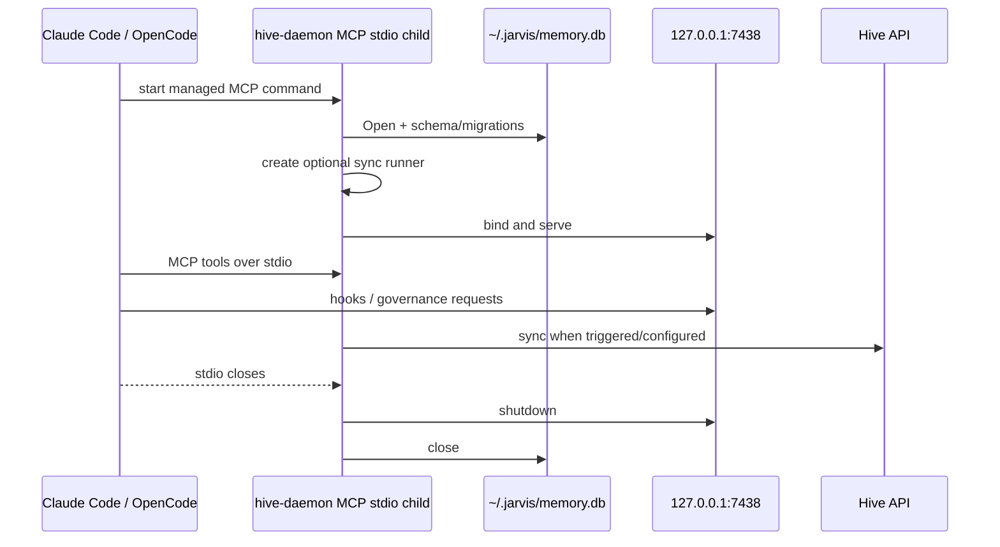
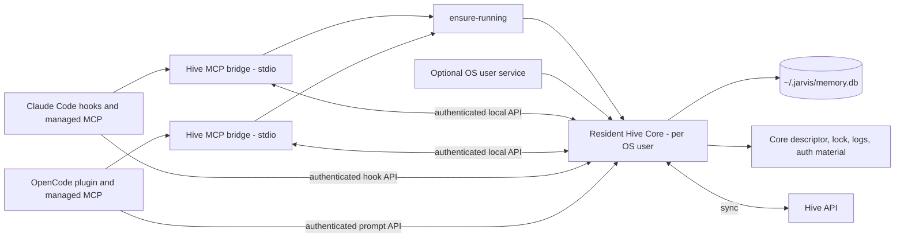

# Proposal: Resident per-user Hive Core with client-independent autostart

> **Recommendation:** evolve Hive from a client-owned MCP stdio process into one **resident, per-user Hive Core** that solely owns `~/.jarvis/memory.db`, local HTTP/API state, migrations, and sync. Each AI client starts only a thin stdio MCP bridge. The bridge uses a portable, idempotent `ensure-running` operation before it connects to Core. The `jarvis` install wizard leaves Core running, verified, and registered as a per-user OS service by default, so Hive is available without opening Claude Code or OpenCode; the service is never a correctness dependency because `ensure-running` remains the fallback.

This is an architecture proposal, not an implementation plan. It deliberately does **not** claim that a resident service, bridge protocol, authentication token, service units, or automatic startup exists today.

**Immediate priority:** issue **#639 remains the bootstrap safety fix**. Its scope is directory-backed canonical project bootstrap across `mem_save`, `mem_session_summary`, Claude Code SessionStart fallback, and OpenCode `/prompts`, including Git-origin/basename identity rules, explicit-project mismatch handling, idempotence, the reserved `default` guard, session/project mismatch preservation, and observable OpenCode non-2xx failures. It does not generally make the client-owned daemon ready, establish a resident owner, or change this proposal's security/lifecycle contract. Any temporary cold-start retry or readiness hardening is a separately scoped prerequisite or follow-up with its own bounded behavior and acceptance criteria.

**Related cheap mitigation (separate issue):** the install scripts must refuse to replace `hive-daemon` while a daemon process is running and tell the user to close Claude Code and OpenCode first. Today `scripts/install.sh` moves the new binary over the running one and `scripts/install.ps1` force-kills the process before replacing it. This mitigation is not part of this proposal's implementation scope.

## Review path

### Document scope and size exception

The proposal's single-file size is an accepted review-size exception. It remains one cohesive architecture document because process ownership, local trust, descriptor/readiness lifecycle, upgrade fencing, platform services, and rollout gates are mutually constraining decisions. Splitting it would force reviewers to reconstruct incomplete fragments and obscure the invariants that must be reviewed together; headings, tables, and the review path provide the intended review slices instead.

1. Review the recommendation and boundaries in [Decision summary](#decision-summary).
2. Check the install surface, platform, and terminology baseline in [Assumptions](#assumptions), [Terminology](#terminology), and [Supported platforms](#supported-platforms).
3. Validate the current-state evidence in [Why the current lifecycle cannot be the target](#why-the-current-lifecycle-cannot-be-the-target).
4. Challenge the ownership, authentication, and upgrade invariants in [Target architecture](#target-architecture).
5. Approve, defer, or resolve the questions in [Open decisions](#open-decisions).

Related documents: `docs/hive/hive-local/hive-spec.md` is the baseline Hive specification this proposal extends, and `docs/hive/sync-guide.md` describes the credential and `sync.json` handling the resident Core must keep.

## Decision summary

| Topic | Proposed decision | Why it matters |
| --- | --- | --- |
| Process owner | One Core process per OS user owns durable state and sync. | SQLite, migrations, and sync state have one serial authority. |
| MCP integration | Claude Code and OpenCode run a short-lived stdio bridge, not the Core. | A client closing no longer terminates local memory availability. |
| Startup | Every bridge calls an idempotent `ensure-running` before its first Core request. | Correct even when no OS service is installed or loaded. |
| Install surface | The `jarvis` install wizard (TUI and non-TUI) leaves Core running, verified, and registered for per-user autostart, with autosync enabled when configured. | Hive is available right after installation without opening any AI client. The team never runs `jarvis init`. |
| Service manager | Register the per-user OS service from the wizard by default, with opt-out; `ensure-running` stays the fallback and the readiness authority. | Hive returns after login or reboot without a client, while correctness never depends on the service manager. |
| Client fallback | Bridges and hooks still start a stopped Core through `ensure-running` and surface a user-visible warning when they cannot. | Preserves today's "open the client and Hive comes up" behavior and makes failures visible instead of silent. |
| Local transport | Retain loopback HTTP initially, but require per-install local authentication and capability scopes. | A persistent unauthenticated loopback API is not an acceptable capability boundary. |
| Port | A descriptor advertises the actual loopback port; do not make a fixed port the identity. | Prevents multi-client bind races and supports collision recovery. |
| State | Core alone opens `memory.db`, executes migrations, owns backups, and runs sync. | Prevents concurrent migration and write ownership ambiguity. |
| Uninstall | Remove executable/service/descriptor by default; preserve `memory.db` unless the user explicitly requests data deletion. | Local-first data must not disappear as a side effect of uninstall. |

### Goals

- Make Hive available independently of the lifetime or startup ordering of Claude Code, OpenCode, or any future client.
- Leave Core running, verified, and registered for per-user autostart at the end of the `jarvis` install wizard, with autosync enabled when the user configured Hive API credentials.
- Keep the client-side fallback: when Claude Code or OpenCode start and Core is stopped, they start it; when they cannot, the user sees a warning instead of a silent failure.
- Preserve local-first behavior: Core continues serving local reads and writes when remote sync is unavailable.
- Make startup safe under concurrent clients, stale descriptors, crashed processes, port collisions, and interrupted upgrades.
- Give `jarvis doctor` and `jarvis reconcile` enough observable state to diagnose and repair lifecycle drift.
- Preserve existing `~/.jarvis/memory.db` data without requiring a destructive migration.
- Establish a local authentication and capability boundary before a persistent Core exposes privileged governance/configuration operations.

### Non-goals

- Replacing MCP stdio with a network MCP transport.
- Exposing Hive outside the local user boundary or supporting remote access to the local API.
- Changing Hive API/cloud authorization or the Hive ↔ Hive API sync protocol.
- Making the OS service a correctness dependency: `ensure-running` must work with the service missing, disabled, or failed.
- Sharing one Core or one `memory.db` between a Windows host and a WSL distro.
- Solving #639 by waiting indefinitely in a hook, adding arbitrary sleeps, or assuming MCP already exists.
- Deleting, moving, or recreating `memory.db` during ordinary install, upgrade, reconcile, or uninstall.
- Reinterpreting `jarvis sync`: it remains desired-state replay, not Hive memory synchronization.

### Assumptions

- The team installs and reconfigures the ecosystem through the `jarvis` wizard (`jarvis-cli/internal/tui`, TUI and non-TUI variants). `jarvis init` is not the install surface in practice and this proposal does not target it.
- Today the wizard writes `~/.jarvis/sync.json`, creates an empty `memory.db` placeholder, and registers `hive-daemon` as an MCP stdio command. It never starts the daemon and never verifies HTTP readiness.
- One OS user owns one Hive data root. Multi-user machines get one Core per user.
- Users are technical team members; clear diagnostics and explicit remediation messages are acceptable where a consumer product would need silent self-healing.
- Supported AI clients are Claude Code and OpenCode. Future clients reuse the bridge contract.
- Hive API sync is optional. A Core with no cloud credentials is fully functional locally.

### Terminology

| Term | Meaning |
| --- | --- |
| Core | The resident per-user `hive-daemon` process that owns SQLite, migrations, the local API, logs, and sync. |
| Bridge | The short-lived stdio MCP adapter a client launches; it talks to Core and owns no durable state. |
| `ensure-running` | The idempotent operation that returns a verified Core endpoint, starting Core only when no live owner exists. |
| Descriptor | The state-root file that advertises a candidate Core, its endpoint, identity, and lifecycle state. |
| Start lock | The atomic filesystem lock that elects one starter during startup transitions. |
| Coordinator fence | The persistent marker an installer or uninstaller holds so nothing respawns Core while it is being replaced or removed. |
| Readiness generation | A counter Core bumps each time it publishes a new `ready` descriptor, so stale readiness can be detected. |
| Legacy daemon | A `hive-daemon` started the current way by an AI client, holding the fixed port and the database without a descriptor. |
| Service manager | The per-user OS facility that starts Core at login: `systemd --user`, LaunchAgent, or Windows Scheduled Task. |

### Supported platforms

The supported set is everything Jarvis already claims to support. The proposal must not silently narrow it.

| Platform | Support level | Autostart mechanism | Platform rule |
| --- | --- | --- | --- |
| Linux native | Supported | `systemd --user` unit registered by the wizard; on-demand `ensure-running` fallback. | Do not assume lingering; if the user manager is unavailable, report the fallback through doctor. |
| Windows native | Supported | Per-user Scheduled Task at logon; on-demand fallback. | Job Objects and locked executables need the detachment and staged-replacement rules below. Windows CI already validates the CLI and PowerShell hooks. |
| WSL | Supported, treated as Ubuntu/Linux | `systemd --user` inside the distro, which requires `systemd=true` under `[boot]` in `/etc/wsl.conf`; on-demand fallback when systemd is disabled. | Core lives only while the distro lives. WSL shuts the distro down shortly after the last session closes, so "always on" needs a Windows-side keep-alive: the wizard should register a Windows logon task that boots and holds the distro, or the guide must document the keep-alive requirement. A Windows host and a WSL distro are two separate data roots with two separate Cores; they never share memory. |
| macOS | Best effort | LaunchAgent; on-demand fallback. | No release gate blocks on macOS-only defects, matching the repository's current release posture. |
| Containers, SSH-only hosts, devcontainers | On-demand only | `ensure-running` from bridges and hooks. | No service registration; doctor reports the on-demand mode explicitly. |

## Why the current lifecycle cannot be the target

### Current lifecycle: one MCP child owns the whole local system

Today `hive-daemon/cmd/hive-daemon/main.go:run` is launched as an MCP stdio server. In that same process it:

1. resolves `dbFilePath()` (default `~/.jarvis/memory.db`), performs scheduled restore handling, and calls `db.Open`;
2. runs startup migration/preflight work and stale-session maintenance;
3. creates the optional sync runner with `hivesync.New` via `applyStartupSyncConfig`;
4. starts `httpapi.Server.Start` in a goroutine on `httpAddr()`; and
5. blocks in `sdkmcp.Server.Run(..., &sdkmcp.StdioTransport{})`.

When stdio closes or the MCP client exits, `run` cancels the shared root context, waits for the HTTP goroutine, and closes the database. Thus the MCP child currently owns SQLite, HTTP availability, and the in-process sync runtime together.

The implementation already acknowledges the consequence of this ownership model. The comment above `adoptInterruptedMigrationRuns` in `hive-daemon/cmd/hive-daemon/main.go` says a daemon is spawned per MCP client session and can be cut off when that client goes away. `internal/db.Open` also configures a 15-second SQLite busy timeout specifically because multiple MCP-session processes can open the same database while startup migration work takes an exclusive write transaction.

### Evidenced cold-start ordering

Claude Code hook wiring has a path that precedes MCP readiness:

- `jarvis-cli/internal/hook/events.go:RunSessionStart` invokes `DaemonClient.PostSessionStart` to `POST /sessions`, with a four-second timeout, then returns Hive protocol context regardless of that request's result.
- `RunPromptSubmit` posts to `/prompts` with a 1.5-second budget.
- `RunSubagentStop` and `RunSessionStop` similarly address the local HTTP endpoint independently of the MCP transport.
- `jarvis-cli/internal/hiveclient/client.go:NewFromEnv` defaults the control-plane client to `http://127.0.0.1:7438` (or `HIVE_HTTP_PORT`).

Those hooks are executed by the client lifecycle. They cannot safely assume the separate managed MCP child has been created, completed `db.Open`, finished migration preflight, or bound the HTTP listener. A SessionStart call can therefore observe connection refusal even though the MCP child may be started later in the same client session.

Issue #639 addresses directory-backed canonical project bootstrap across `mem_save`, `mem_session_summary`, Claude Code SessionStart fallback, and OpenCode `/prompts`, including identity derivation and mismatch guardrails, idempotence, session safety, and observable OpenCode failures. It does not establish daemon readiness, a persistent process owner, an inter-client startup contract, or a safe authentication model; those are the purpose of this proposal. A temporary retry/readiness change, if later justified, must be specified and evaluated separately rather than attributed to #639.

### Multiple-client risks

| Risk | Present mechanism/evidence | Consequence if retained |
| --- | --- | --- |
| Port ownership | `httpAddr()` uses fixed `127.0.0.1:7438` by default; `httpapi.Server.Start` calls `ListenAndServe`. | Two client-owned children race to bind. One loses HTTP while both may still manipulate the DB. |
| SQLite ownership | `db.Open` is run by each daemon process; `internal/db/db.go` documents multiple session processes sharing `memory.db`. | Busy waits reduce immediate failure but do not create a single mutation/migration owner. |
| Migration ownership | Startup runs restore handling, interrupted-run adoption, identity migration preflight, and schema initialization. | One client can begin structural work while another client is starting or stopping. |
| Sync ownership | `run` creates a `SyncRunner`; MCP `syncRuntime` reloads configuration and creates sync runners around the same store. | Concurrent drains, duplicated attempts, and unclear retry/backoff ownership become more likely. |
| Client shutdown | stdio shutdown cancels the root context that owns HTTP and DB. | OpenCode prompt capture and CLI/TUI governance lose Core when an unrelated MCP client exits. |
| Hook ordering | Hooks call HTTP before MCP readiness is guaranteed. | Cold-start behavior depends on timing, not a contract. |
| Version skew | `hive-daemon/internal/mcp/server.go` hardcodes the MCP server version and nothing in `jarvis-cli` checks a daemon version. | An old daemon and a new CLI or bridge can silently disagree about API and schema. |
| Install surface | The `jarvis` wizard registers the daemon as an MCP command and never starts or verifies it. | After a fresh install nothing runs until an AI client opens. |

### Existing local boundary is insufficient for a persistent server

`httpapi.Server.Start` rejects non-loopback listener addresses, and selected handlers call `requireLoopback`. The code explicitly describes the current phase as loopback access **rather than a bearer-token boundary** (`hive-daemon/internal/httpapi/server.go:isLoopbackAddr`). `jarvis-cli/internal/hiveclient.Client` sends no local authorization header.

Loopback-only is a useful exposure reduction, but not an authorization boundary for a long-lived API with endpoints that read memory, update sync configuration, create backups, restore data, or execute governance mutations. A resident Core must not inherit this unauthenticated trust model.

Credential handling has the same shape. When Hive API credentials exist, `jarvis-cli/internal/agent/opencode.go` writes `HIVE_API_URL`, `HIVE_API_EMAIL`, and `HIVE_API_PASSWORD` in plaintext into the `environment` block of the managed OpenCode MCP entry, so the daemon's sync configuration depends on which client launched it. The launcher template `jarvis-cli/embed/templates/hive-daemon-start.sh.tmpl` is not used by any production code path; it appears only in a test fixture. `hive-daemon` already reads the same credentials from `~/.jarvis/sync.json`, which is the source a resident Core must use.

## Target architecture

### Components and ownership

**Hive Core** is the only durable-state owner. It opens and migrates SQLite, owns the HTTP listener and local authentication verification, serializes sync scheduling, manages recovery state, and has a stable process identity. It must expose a small versioned local API that both bridges and hooks can call.

**Hive MCP bridge** is a client-launched stdio adapter. It must not open SQLite, bind the Core port, run schema migrations, or independently own sync. On startup it calls `ensure-running`, waits only for bounded readiness, authenticates to Core, and translates MCP tool calls into Core API calls. Its exit affects only that bridge's stdio connection.

**Client hooks/plugins** become Core clients. Claude Code hooks retain their non-blocking/fail-safe behavior. OpenCode performs bounded, awaited, non-fatal prompt capture: it waits at most one second for descriptor/ensure resolution and the capture attempt, then returns without surfacing a prompt-blocking error. Both must invoke the same bounded ensure/readiness path before a request that needs Core. They must not spawn their own long-lived daemon without coordination. When Core is stopped, this path starts it, preserving today's behavior of opening a client and getting Hive. When Core cannot be started, the client surfaces a user-visible warning: Claude Code through the Jarvis-managed statusline and the SessionStart context message, OpenCode through a plugin toast; `jarvis doctor` explains the typed failure.

### Core invariants

1. **Exactly one writable Core owns one user data root.** A running Core is identified by instance metadata and authenticated readiness, not only by a PID or open port.
2. **Only Core opens the writable SQLite database.** Bridges, hooks, CLI/TUI adapters, and service managers use the local API. Offline tools that require direct DB access must be explicitly designed as exclusive maintenance mode, not silently coexist.
3. **Only Core migrates.** Migrations, backup-before-critical-operation behavior, restore scheduling, and startup preflight move from a client-owned `run` lifecycle to Core startup/maintenance lifecycle unchanged in intent.
4. **Only Core schedules sync.** `mem_sync` requests a Core-managed drain; auto-sync is a Core policy, not one runtime per MCP client.
5. **A ready descriptor is cryptographically and operationally verified.** Its information alone never grants access.
6. **A bridge never silently falls back to a second Core.** Failure to ensure a verified singleton is a clear, bounded unavailable result.

### Portable idempotent `ensure-running`

The first deliverable should be a cross-platform Core subcommand/API, conceptually `hive-daemon ensure-running`, used by all integration points. It is the availability primitive regardless of whether an OS service is installed.

#### Required algorithm

1. Resolve the per-user Hive state root and canonical executable path.
2. Read the persistent coordinator maintenance/uninstall fence before acquiring or acting on a start lock. While a valid fence is held, return a typed maintenance/uninstall result and do not spawn or replace Core.
3. Acquire a **start lock** with ownership metadata and bounded wait. The lock must be atomic on the local filesystem and must not be inferred from the port.
4. Read the descriptor, if present, including its `starting`, `ready`, or `migration-blocked` state.
5. Perform authenticated `/readyz` (or equivalent) against the descriptor endpoint. Verify protocol version, instance ID, descriptor/readiness generation, and executable/build compatibility policy.
6. If the descriptor is `ready` and readiness is verified, return the endpoint/capability result without spawning anything. A `starting` or `migration-blocked` descriptor with a verified live owner is not stale: wait only through the owner lease/readiness deadline, then return its typed state.
7. If stale, record diagnostic evidence, atomically replace only the stale descriptor/lock state, start Core detached from the caller, and wait for authenticated readiness with a fixed timeout.
8. Return either a verified endpoint or a typed failure that names the failed phase (maintenance fenced, lock timeout, spawn failed, migration blocked, listener collision, authentication mismatch, readiness timeout).

The operation must be safe for simultaneous Claude Code, OpenCode, CLI, and hook invocation. Idempotence means concurrent callers converge on the same verified instance; it does not mean ignoring a failed launch.

#### Descriptor, identity, readiness, and lock

The proposal intentionally separates these concepts:

| Artifact | Purpose | Minimum fields | Do not use it as |
| --- | --- | --- | --- |
| Start lock | Elect one starter and protect startup transitions. | format version, owner PID, process-start fingerprint, acquired/lease timestamps, nonce. | Proof that Core is healthy. |
| Coordinator maintenance/uninstall fence | Prevent `ensure-running` from respawning Core while an authorized coordinator replaces, removes, or maintains it. | format version, operation (`upgrade`, `uninstall`, `maintenance`), coordinator owner ID/PID/start fingerprint, acquired/lease timestamps, nonce, explicit release state. | A permanent denial of availability or a substitute for the start lock. |
| Instance descriptor | Discover a candidate Core and its lifecycle state. After listener creation, Core atomically publishes a provisional `starting` descriptor; only verified readiness atomically replaces it with `ready` and a new readiness generation. | format/protocol version, instance ID, PID plus start fingerprint, loopback address/port, started-at, build version, token/key ID, descriptor state/generation, readiness generation. | Authorization credential or sole liveness proof. |
| Auth material | Authenticate local callers and bind granted capabilities. | token/key ID, secret stored with user-only permissions, rotation metadata. | A value embedded in MCP configuration or logs. |
| Readiness response | Prove the process behind the endpoint is this Core and is safe to serve. | instance ID, protocol version, database/migration state, API capability set, readiness generation. | A generic HTTP 200 health check. |

Use atomic write-then-rename for descriptors, restrictive owner-only permissions for state/auth material, and a process-start fingerprint in addition to PID to defeat PID reuse. Core binds its listener first, then atomically publishes the provisional `starting` descriptor so other callers can discover the elected owner without treating it as ready. After migrations and recovery gates pass, Core atomically publishes `ready` with a new readiness generation. If a migration gate blocks, it atomically records `migration-blocked` instead. A stale descriptor is removed only after failed authenticated readiness and failed owner identity verification, never solely because its timestamp is old.

The coordinator fence is a persistent state-root artifact, not an in-memory installer flag. Only the authorized installer/reconciler coordinator may acquire an in-progress fence; it records owner identity and a bounded lease, and `ensure-running` must check it before every spawn/replacement decision. A successful maintenance or upgrade explicitly releases its fence only after its terminal state is recorded. A successful uninstall instead transitions the fence to a persistent terminal `uninstalled` state, which `ensure-running` honors until an explicit wizard reinstall atomically installs assets and clears it. If an in-progress coordinator crashes, recovery requires lease expiry **and** failed owner identity verification, records diagnostic evidence, and leaves data untouched; a live owner is never displaced merely because a timestamp is old.

`/livez` may report that the process is alive; `/readyz` must report whether migrations/recovery gates are complete enough to accept the requested capability. A migration-blocked Core is alive but not generally ready; the response must preserve the existing recoverable migration status rather than making bridges retry forever.

#### Spawn detachment and process-tree survival

Claude Code and OpenCode terminate the process trees of their MCP children when they exit, and Windows can place children in a Job Object that kills grandchildren too. Nothing in the repository detaches a spawned process today: there is no `Setsid`, `Setpgid`, or `DETACHED_PROCESS` usage. A Core spawned naively from a bridge would die with the client that launched it, which is exactly the coupling this proposal removes.

Required rules:

1. When a per-user service is registered, `ensure-running` starts Core through the service manager (`systemctl --user start`, `launchctl kickstart`, `schtasks /Run`), so the service manager is the parent and the client is not.
2. When no service is registered or the service manager fails, `ensure-running` spawns Core in a new session and process group (`setsid` semantics on Unix; `DETACHED_PROCESS` plus a new process group and job breakaway where permitted on Windows), closes inherited stdio and descriptors, and redirects Core output to its log file.
3. If detachment is impossible in the current environment, `ensure-running` returns a typed `detach-unsupported` failure rather than starting a Core that will die with the caller.
4. Integration tests must prove that Core survives the exit of the launching client under each supported client and platform.

#### Core configuration source

Core resolves its data root, port policy, log location, and sync credentials from the Hive state root (`~/.jarvis`), never from the environment of whichever process spawned it. A Core started by a service manager, by a bridge, or by hand must behave identically. `HIVE_DB_PATH` and `HIVE_HTTP_PORT` remain explicit compatibility overrides during migration; an override that would produce a different Core identity is rejected with a diagnostic rather than silently starting a second Core. Sync credentials come from `~/.jarvis/sync.json`; the plaintext `environment` block in the managed OpenCode MCP entry is removed once Core owns sync.

### Port strategy

The default port `7438` is a current convenience, not a durable process identity. The target strategy is:

- bind Core to `127.0.0.1` only (and consider the IPv6 loopback policy explicitly during implementation);
- prefer a configured stable port only when it is available and belongs to no different Core instance;
- otherwise select an ephemeral loopback port (`127.0.0.1:0`) and publish it in the authenticated descriptor;
- have all Jarvis-managed callers resolve the descriptor through `ensure-running`, not reconstruct `http://127.0.0.1:7438` independently;
- retain `HIVE_HTTP_PORT` as an explicit compatibility/configuration input during migration, with clear collision diagnostics;
- reject a descriptor endpoint whose ready response does not match descriptor instance identity.

A fixed port alone cannot solve multiple-client ownership, and an ephemeral port alone cannot solve discovery. The descriptor plus authenticated readiness provides both collision recovery and discovery.

### Local authentication and capability boundary

A persistent Core makes every local process on the machine a potential caller. The baseline trust boundary is the OS user: arbitrary processes running as that same user are inside it. Owner-only files and bearer/capability material protect against accidental misuse and other OS users with normal filesystem isolation; they cannot prevent a hostile same-user process from reading accessible material, impersonating a managed client, or controlling the user's process environment. The design must introduce authentication before moving privileged existing HTTP surfaces into a resident process, but it must not overclaim same-user hostile-process isolation.

**Baseline proposal**

- Generate a random per-user local secret during install/bootstrap; store it in the Hive state root with owner-only filesystem permissions.
- Require a local request credential for every Core endpoint, including hook/prompt/session endpoints. Do not rely only on remote address checks.
- Pass credentials to Jarvis-managed bridges/hooks by a protected launch mechanism or a token-file reference, not command-line arguments, public environment dumps, generated client config, or logs.
- Use short-lived, scoped capability tokens derived from the root secret where practical. A bridge receives MCP read/write/sync-request capabilities; a hook receives prompt/session capabilities; the CLI/TUI receives explicit governance/maintenance capabilities.
- Bind tokens to protocol version, client kind, expiration, and optionally the instance ID/descriptor generation to make stale credentials diagnosable and rotation possible.
- Keep loopback-only listener validation as defense in depth, not as authorization.
- Never make the Hive API/cloud JWT a local Core credential. Local auth and remote sync auth are separate trust domains.

These capabilities constrain managed components, reduce accidental privilege use, and protect across ordinary OS-user boundaries; they are not a defense against arbitrary hostile code under the same OS user. Stronger isolation is an open option: an OS-backed credential broker plus authenticated Unix-socket/named-pipe peer identity (or an equivalent platform mechanism) could define a narrower client identity boundary, but requires a cross-platform design and explicit support decision.

For baseline cross-user/accidental port-impostor protection, the protocol must not treat possession of a bearer token as server proof. One credible option is a descriptor authenticated with local root material that carries an instance public verification key, followed by a nonce challenge signed by the Core's corresponding private key before the client sends a scoped credential or request data. This authenticates the advertised instance to clients that can protect the root material; it does not defeat a same-user adversary, which remains inside the baseline trust boundary. The exact protocol may remain open only if implementation defines equivalent server-authentication, rotation, and downgrade protections before rollout.

### SQLite, migration, and sync ownership

`internal/db.Open` currently enables WAL, validates schema/triggers, runs additive migrations, and sets `sqliteBusyTimeout`. Under the target design this behavior is centralized in Core. The target is not “more tolerant multi-process SQLite”; it is one normal writable owner.

| Concern | Current anchor | Target rule |
| --- | --- | --- |
| Database path | `cmd/hive-daemon/main.go:dbFilePath` | Preserve `~/.jarvis/memory.db` as the default canonical data file. |
| Schema/migrations | `hive-daemon/internal/db/db.go:Open`, `initSchema` | Run once under Core startup lock; report migration state through readiness/doctor. |
| Project identity migration | `runStartupMigration`, `project.MigrationGate` | Core owns gate and recovery lifecycle; bridge returns structured blocked state. |
| Backup/restore | `governance.NewSQLiteBackupStore`, `ScheduleRestore` | Core serializes maintenance and performs no destructive auto-repair. |
| Sync config | `internal/sync.LoadWithStatus`, `sync.Service` | Core reloads/updates configuration with authenticated admin capability. |
| Sync work | `hivesync.New`, MCP `syncRuntime` | Core serializes manual drains, automatic retries/backoff, and telemetry. |

The Core must retain the existing local-only fallback: malformed sync configuration or remote failure records a warning/health outcome but does not prevent local memory operations. Sync triggers received from multiple bridges must coalesce by project and policy; a manual request can observe or join an in-progress drain rather than begin a competing one.

### Crash recovery and failure states

| Failure | Required behavior |
| --- | --- |
| Bridge crashes | Core remains running; no DB or HTTP shutdown. A new bridge ensures and reconnects. |
| Core crashes before descriptor publication | Start lock lease expires after owner identity verification; a later ensure starts a replacement. |
| Core crashes after descriptor publication | Authenticated readiness fails; stale-process verification and lock protocol elect one replacement. |
| Process killed during migration | Existing transactional migration/backup/recovery semantics remain Core-owned. Readiness reports blocked/recovery-required, not false ready. |
| Port stolen/collision | Descriptor/ready identity mismatch is a security error; do not send data to the occupant. Ensure picks a new port only after stale ownership is established. |
| SQLite corruption or unrecoverable migration | Core fails closed with actionable doctor output; do not create a blank DB over `memory.db`. |
| Remote sync failure | Core stays locally available; persist failure/backoff status as current health models intend. |
| Service manager restarts repeatedly | Apply bounded restart backoff and surface a doctor-visible failure; avoid a hot crash loop. |
| Client starts before Core is ready | Bounded `ensure-running` waits for readiness; client follows its existing fail-safe/degraded contract after a typed failure and surfaces a user-visible warning. |
| Legacy daemon holds the port and database | `ensure-running` classifies an occupant with no descriptor and no authenticated readiness as `legacy-daemon-active`. Core does not start a second writer beside it; the bridge returns a typed unavailable result whose remediation is to close the AI clients that own the legacy daemon, and doctor reports the same state. |
| Core launched from a bridge dies with the client | Prevented by service-manager-parented start or detached spawn; a `detach-unsupported` environment returns a typed failure instead of a short-lived Core. |

## Lifecycle management by platform

### Phased service approach

`ensure-running` is mandatory in every phase. The per-user service is the default lifecycle manager registered by the install wizard so Hive is present without opening a client; it is never a condition for correctness. Users may opt out, and the fallback must keep working with the service missing, disabled, or failed. This supports portable installations, terminals without a user service manager, and repair flows.

Service lifecycle must start Core using a stable launcher/config file rather than embedding mutable credentials in a service definition. The service invokes Core in resident mode and shares the descriptor, start-lock, and maintenance-fence protocol with on-demand startup. Service restart policy must not bypass a valid coordinator fence.

### Windows: Scheduled Task before Windows Service

**Recommendation:** use a per-user **Scheduled Task** as the initial Windows service-manager integration, not a Windows Service.

| Option | Advantages | Costs / rationale |
| --- | --- | --- |
| Scheduled Task (recommended first) | Native per-user logon trigger; no elevation required for a user-owned install; aligns with `~/.jarvis` user data and desktop session lifecycle; inspectable/removable by the same user. | May not run before user logon and has Task Scheduler-specific diagnostics. This is acceptable because `ensure-running` covers demand startup. |
| Windows Service (defer) | Stronger always-on lifecycle, restart policy, can run without interactive login. | Usually requires installation/elevation, introduces service-account/profile/ACL complexity, and risks separating the service identity from the user’s `~/.jarvis` data and credentials. It is disproportionate for the per-user local-first MVP. |

A Windows Service may become an enterprise-managed option only after an explicit account/data-root model, upgrade protocol, and support requirements are approved. It must not silently run as a different user against a different memory database.

### macOS: LaunchAgent

Use a per-user `LaunchAgent`, not a system `LaunchDaemon`. A LaunchAgent runs in the logged-in user context, naturally owns that user’s state root, can use `RunAtLoad`/keep-alive policy, and needs no root installation for a user-scoped product. Keep `ensure-running` for non-GUI/SSH/timing cases and diagnostics.

### Linux: systemd --user, with fallback

Where available, use a `systemd --user` unit tied to the user session and state root. Do not assume user lingering is configured or that every distribution/session exposes a usable user manager. If it is unavailable, disabled, or fails installation, retain on-demand `ensure-running` and report the fallback clearly through doctor. Do not replace the fallback with a root system unit. WSL follows this Linux path inside the distro; see [Supported platforms](#supported-platforms) for the distro-lifetime and keep-alive rule.

## Integration boundaries

### Installer, init, reconfigure, doctor, reconcile, and `jarvis sync`

| Surface | Proposed responsibility | Must not do |
| --- | --- | --- |
| Installer / `jarvis` wizard (TUI and non-TUI) | Install/update Core and bridge assets; initialize state root and local auth material; register the per-user service by default with opt-out; configure managed clients to use the bridge/ensure contract; finish by running `ensure-running`, verifying authenticated readiness, and reporting the result, with autosync active when credentials were configured. | Delete `memory.db`, start duplicate Cores, treat service registration as proof of readiness, or replace `hive-daemon` while a daemon process is running. |
| Reconfigure | Update desired Core/client/service policy; rotate local credentials through a controlled handoff; request Core reload/restart when needed. | Persist replay state in `~/.jarvis/config.yaml` or leak secrets into templates/logs. |
| `jarvis doctor` | Check binary/version, descriptor integrity, authenticated readiness, auth permissions, start-lock and maintenance-fence state, service registration/status, data accessibility, migration/recovery state, and sync health. | Repair state silently. |
| `jarvis reconcile` | Repair observed drift: missing/stale managed service definition, bridge configuration, descriptor/lock cleanup when safely proven stale, safely expired coordinator-fence recovery, and client integration. | Reconfigure user-owned settings broadly, clear a live fence, or conflate repair with desired-state replay. |
| `jarvis sync` | Replay recorded agent configuration from `~/.jarvis/state.yaml`, including managed MCP/skills/persona/statusline according to current contract. It may render bridge configuration that uses ensure-running. | Synchronize Hive memory data, prompt, call `config.Save()`, or take the manifest lock in a way that deadlocks its own replay path. |
| Uninstall | Acquire the persistent uninstall fence, stop/disable managed Core and its service/task, then remove managed binaries, bridges, descriptors, locks, auth material, and service definitions; atomically retain a terminal `uninstalled` fence until explicit wizard reinstall clears it. | Delete `~/.jarvis/memory.db` or backups by default, or permit `ensure-running` to respawn Core during removal. |

The existing replay boundary is important: `jarvis-cli/internal/sync/mcps.go:MCPComponent.Apply` renders/replaces Jarvis-managed MCP definitions, and its comments establish that replay is non-interactive managed-state replacement. The proposal changes the managed command from “start the stateful daemon” to “start the stateless bridge that ensures Core,” while preserving that boundary.

### Lifecycle commands

The issue asks for install, enable, start, stop, restart, upgrade, rollback, and uninstall behavior. Upgrade, rollback, and uninstall are covered below; the remaining verbs need a user-facing surface. Names are indicative and the exact placement is a technical-design decision, but the contract is part of this proposal:

| Command | Contract |
| --- | --- |
| `jarvis hive status` | Show descriptor state, authenticated readiness, instance identity, endpoint, service registration and state, migration/recovery state, sync health, and any legacy daemon detected. Read-only. |
| `jarvis hive start` | Run `ensure-running` and print the typed result. Never starts a second Core. |
| `jarvis hive stop` | Identity-verified graceful stop of the resident Core; honors a live coordinator fence; never touches `memory.db`. |
| `jarvis hive restart` | `stop` followed by `start` with readiness verification. |
| `jarvis hive enable` / `disable` | Register or unregister the per-user service definition without touching data or the running Core. |
| `jarvis hive logs` | Show the redacted tail of the Core log file, with a follow option. |

`jarvis doctor` today has no check for the daemon binary, the port, or `memory.db` (`jarvis-cli/internal/lifecycle/engine.go`); the status model above is what doctor must gain.

### Claude Code

- Managed MCP configuration should launch `hive-mcp-bridge --client=claude-code` (or equivalent), not a Core instance.
- `RunSessionStart`, `RunPromptSubmit`, `RunSubagentStop`, and `RunSessionStop` in `jarvis-cli/internal/hook/events.go` call the Core client through `ensure-running` with their current bounded, non-fatal semantics.
- SessionStart must not block indefinitely while Core migrates. It should return the protocol text and log/diagnose a typed Core-unavailable state. Before the architectural transition, #639 covers SessionStart only as one surface within the broader directory-backed canonical project bootstrap contract; it does not provide Core readiness.
- The bridge obtains only the capabilities needed for MCP memory tools. Hook credentials must not grant governance/restore capabilities.
- When Core is stopped, the hook path starts it. When it cannot, the Jarvis-managed statusline shows a Hive-unavailable state and the SessionStart context message names the typed failure.

### OpenCode

- The existing embedded plugin at `jarvis-cli/embed/hooks/opencode/hive.ts` currently posts to `http://127.0.0.1:${HIVE_PORT}` and silently ignores unavailable daemon errors. Migrate it to descriptor/ensure resolution with one total one-second timeout for resolution and capture; awaiting that bounded attempt must not produce a prompt-blocking UI error.
- Managed OpenCode MCP integration should use the same stateless bridge/Core split as Claude Code.
- Preserve advisory migration-status behavior and make a missing Core diagnosable through doctor/logging rather than an unexplained fixed-port failure. Timeout, authentication, or unavailable outcomes are non-fatal after the one-second bounded attempt; the plugin must neither retry indefinitely nor detach an unbounded background request.
- When Core cannot be started, the plugin shows a non-blocking toast with the typed failure instead of silently ignoring it.

## Compatibility and migration stages

### Stage 0 — bootstrap safety (#639)

Deliver the immediate directory-backed canonical project bootstrap contract across `mem_save`, `mem_session_summary`, Claude Code SessionStart fallback, and OpenCode `/prompts`, including Git-origin/basename derivation, explicit-project mismatch, idempotence, the reserved `default` guard, session/project mismatch preservation, and observable OpenCode non-2xx failures. No resident Core claim, general daemon-readiness guarantee, port protocol change, service install requirement, or telemetry mandate belongs to #639. Any temporary cold-start retry/readiness hardening is a separately approved prerequisite or follow-up.

### Stage 1 — extract Core boundary behind compatibility APIs

Refactor the daemon process conceptually into Core-owned state/API operations and bridge-owned stdio adaptation. Keep the current HTTP endpoint shapes where possible. Add versioned readiness and authenticated local calls, initially behind compatibility controls. Existing `memory.db` stays in place. No version handshake exists today: `hive-daemon/internal/mcp/server.go` hardcodes the MCP server version and `jarvis-cli` never checks a daemon version, so this stage must add the versioned readiness endpoint before any compatibility policy can be enforced.

### Stage 2 — introduce descriptor, lock, and `ensure-running`

All Jarvis-managed callers resolve Core through the portable ensure path. Continue accepting the configured/fixed-port compatibility path only for an explicitly defined deprecation window. Doctor identifies old client definitions and unmanaged legacy processes. During this window a legacy daemon owned by an already-open client may still hold the fixed port and the database. Core does not start beside it; `ensure-running` returns `legacy-daemon-active` with the remediation to close those clients, and doctor and the statusline report it. Once every legacy daemon exits, the next ensure starts Core normally.

### Stage 3 — resident on-demand Core default

The bridge and hooks launch/verify Core on demand. The install wizard finishes by running `ensure-running` and verifying readiness, so a fresh install has Core running before any client opens. Validate concurrency, crash recovery, migrations, and multi-client use across Windows, WSL, Linux, and macOS before enabling automatic user-service registration by default.

### Stage 4 — default OS user service registered by the wizard

The wizard registers the per-user service by default, with an explicit opt-out and `jarvis hive enable`/`disable` to change the choice later. Ship default-on only after platform acceptance tests pass on Linux, Windows, and WSL. `ensure-running` remains the fallback and the single readiness authority.

### Stage 5 — retire legacy client-owned daemon command

After a published compatibility window, stop rendering managed MCP commands that launch a stateful stdio daemon. Keep explicit migration diagnostics and a documented rollback period. Do not remove data compatibility.

### Data and configuration migration rules

- Reuse `~/.jarvis/memory.db` in place; take a verified backup before any schema/data transition that requires one.
- Preserve existing `HIVE_DB_PATH` and `HIVE_HTTP_PORT` behavior for controlled/test compatibility until deprecation is approved; document their new scope.
- Migrate managed MCP definitions through Jarvis renderers/reconcilers, never by manually editing user-generated Claude/OpenCode configuration.
- Create local auth material atomically with owner-only permissions. Rotation must leave an overlap window or coordinated Core restart so bridges do not strand active sessions.
- Maintain a clear compatibility matrix between bridge protocol version, Core protocol version, descriptor version, and client asset version. Refuse unsafe version skew with an upgrade instruction, not opaque transport errors.
- Stop rendering Hive API credentials into the managed OpenCode MCP `environment` block once Core reads them from `~/.jarvis/sync.json`; reconcile removes the stale block.

## Alternatives and trade-offs

| Alternative | Benefit | Rejected / deferred because |
| --- | --- | --- |
| Keep one stateful daemon per MCP client and only fix #639 | Smallest short-term change. | Preserves duplicated SQLite/migration/sync ownership and client shutdown coupling. |
| Start daemon from each hook if unavailable | Addresses one caller’s timing. | Makes hooks process supervisors, amplifies races, and duplicates lifecycle logic across clients. |
| Fixed port with retry | Simple discovery. | Does not identify the listener, prevent port hijack, or solve multiple writers. |
| Direct SQLite from every client | Avoids an HTTP API. | Cross-language access, migrations, locking, security, and sync ownership become harder, not simpler. |
| Keep loopback unauthenticated | Lowest friction. | Unacceptable for durable sensitive-memory and governance APIs, even though arbitrary same-user processes remain within the baseline trust boundary. |
| Require the OS service for correctness | Fast steady-state startup. | Platform and privilege failures would make Hive unavailable; does not replace readiness/lock logic. Registering it by default is fine; depending on it is not. |
| Windows Service first | Strong service semantics. | Elevated install/service account/ACL complexity conflicts with a per-user data owner. Scheduled Task fits the initial model. |
| Unix socket/named pipe only | Strong local transport affinity. | Potential future option, but requires cross-platform transport and client/plugin support. Descriptor + authenticated loopback is a lower-risk transition from current HTTP. |

## Threat model

| Threat | Risk | Mitigation required by this proposal |
| --- | --- | --- |
| Accidental or cross-user local caller | Reads memories or triggers governance/configuration changes. | Owner-only state permissions, authenticated requests, least-privilege capability scopes, loopback-only listener, and permissions checks. Arbitrary same-user processes are explicitly inside the baseline trust boundary. |
| Hostile same-user process | Reads local auth material, impersonates a managed client, or controls its process environment. | Not prevented by file-held secrets or bearer capabilities under the baseline model. Treat as in-boundary; evaluate OS-backed broker/IPC peer-identity isolation as a separately designed stronger option. |
| Port squatting / malicious local listener | Bridge/hook sends memory or credentials to an impostor. | Do not trust port or bearer possession as server proof. Use the selected descriptor-authenticated instance verification and nonce-based server proof before scoped credentials or request data; this protects only where the verifier material is protected. |
| Descriptor/lock/fence tampering | Redirects callers, blocks startup, or enables a respawn during maintenance. | Owner-only directory permissions, atomic writes, format validation, signed/MACed descriptor fields where appropriate, owner/process verification, bounded leases, and explicit fence release/recovery. |
| PID reuse / stale lock | Kills or replaces an unrelated process, or prevents recovery. | PID plus process-start fingerprint and authenticated readiness; bounded leases with conservative stale detection. |
| Credential exposure | Local token appears in CLI args, environment dumps, generated configs, logs, or crash reports. | File-reference/secure handoff, redaction, restrictive permissions, rotation, no token logging. |
| Malicious or accidental DB replacement | Data loss or serving attacker-controlled state. | Preserve data root ownership, backup-before-critical maintenance, fail closed on corruption, no auto-create-over-existing failure. |
| Core upgrade/uninstall race | New/old binaries compete for DB/port, incompatible clients connect, or `ensure-running` respawns Core during replacement/removal. | Persistent coordinator maintenance/uninstall fence, start lock, shutdown/drain handshake, identity-verified exit, compatibility matrix, authenticated readiness version checks, and explicit fence release/recovery. |
| Remote API compromise/confusion | Cloud auth reused as local authority. | Separate local and Hive API credentials/trust domains. |
| Denial of service | Repeated ensure/spawn or failing service manager loops. | Coalesced start lock, bounded waits, restart backoff, rate-limited diagnostics. |
| Detached Core dies with its launcher | Hive disappears when the client that started it exits. | Service-manager-parented start when available; new-session/process-group spawn with closed inherited descriptors otherwise; typed `detach-unsupported` failure. |

## Observability and supportability

Core should provide structured, redacted events and a doctor-readable status model. The aim is to make “Hive is unavailable” actionable without exposing memory contents or secrets.

### Required signals

- Core instance ID, Core/bridge/descriptor protocol versions, start reason (`service`, `ensure`, `manual`), and start duration.
- Descriptor generation, readiness state, migration/recovery gate state, current endpoint, and service-manager state.
- Start-lock and coordinator-fence acquisition, wait, explicit release, expiry-recovery, and stale-owner verification outcomes, without exposing secrets.
- Database open/migration version and backup/restore lifecycle outcome.
- Auth failures by capability/client kind, rate-limited and redacted.
- Sync queue/drain outcome, backoff, last success/failure, and coalescing counts.
- Bridge connection count and request latency/error class; no MCP request payload logging by default.
- Hook/plugin ensure failure classification for Core rollout diagnosis. This is optional observability for the resident-Core work, not a requirement or claimed behavior of #639.

### Log file for a resident Core

Today the daemon writes to stderr and the launching MCP client captures it. A Core started by a service manager or detached from a bridge has no console. Core therefore writes structured, redacted logs to a file under the state root (indicatively `~/.jarvis/logs/hive-daemon.log`) with owner-only permissions, size-based rotation, and a bounded number of retained files. Memory contents, credentials, and MCP payloads are never logged by default. `jarvis hive logs` shows the tail and `jarvis doctor` includes the last relevant lines when it reports a failure. Foreground manual runs may additionally log to stderr.

Extend rather than discard the existing health surface: `hive-daemon/internal/httpapi/health.go:HealthSummaryResponse` already models reachability, authentication to the remote API, sync status, unsynced counts, and drain outcome. The new Core status must distinguish **local Core readiness/authentication** from existing **remote Hive API auth/sync health**.

## Testing strategy

Testing must prove contracts and failure recovery, not only successful startup.

| Layer | Required coverage |
| --- | --- |
| Core unit tests | Provisional/ready/migration-blocked descriptor transitions, the selected server-authentication proof, token/capability verification, start-lock and coordinator-fence state machines, stale PID/start-fingerprint handling, version negotiation, and readiness state transitions. |
| SQLite/migration tests | Existing database upgrade in place, concurrent ensure while migration is running, migration-blocked readiness, corruption/no-blank-DB behavior, backup/restore preservation. |
| Bridge tests | MCP tool translation, no direct DB access, idempotent ensure before connection, typed unavailable responses, capability rejection. |
| Hook/plugin tests | SessionStart-before-Core, prompt capture during Core startup, bounded timeout/fail-safe semantics, no arbitrary sleep, OpenCode's awaited non-fatal one-second capture contract, and the user-visible warning when Core cannot be started. |
| Installer tests | The wizard leaves Core running and verified; autosync active when configured; service registered by default and skipped on opt-out; install scripts refuse to replace a running daemon. |
| Integration tests | Two concurrent Claude/OpenCode bridges converge on one Core; client exit leaves Core alive; port collision; stale descriptor; Core crash/restart; sync drain coalescing. |
| Security tests | Non-loopback rejection, missing/wrong/expired/scope-mismatched token, descriptor tampering, port impostor, file permission failures, credential redaction. |
| Platform acceptance | Windows Scheduled Task install/remove/recovery; macOS LaunchAgent; Linux `systemd --user` and no-systemd fallback; WSL with systemd enabled and disabled, including distro shutdown and Windows-side keep-alive; Core survives the exit of the launching client on each platform. |
| Upgrade tests | Old bridge/new Core and new bridge/old Core policy; coordinator fence prevents respawn through replacement/removal; Windows locked executable replacement; rollback without data loss. |
| Doctor/reconcile tests | Missing service, disabled service, stale lock, stale descriptor, live/expired coordinator fence, missing binary, wrong permissions, migration blocked, and repair boundaries. |

Use deterministic time/process abstractions for lock leases and readiness deadlines. Do not make tests depend on arbitrary sleeps or a developer’s real home directory/service manager.

## Upgrades, rollback, and uninstall

### Upgrade protocol

1. Download/verify the new executable and assets before touching the running Core.
2. Acquire the persistent coordinator `upgrade` fence with coordinator ownership metadata and a bounded lease. Once acquired, `ensure-running` and service restart paths must return typed maintenance instead of respawning Core.
3. Ask Core to enter a bounded maintenance/drain state; stop accepting new privileged maintenance work while allowing the defined bridge behavior.
4. Stop or hand off the resident process through its service manager/coordinator; verify the old owner exited using identity, not PID alone.
5. Replace the executable atomically where the platform permits; then start and authenticate the new Core. After it binds its listener it atomically publishes a provisional `starting` descriptor; it atomically publishes the next `ready` descriptor generation only after migration/recovery readiness is verified. A migration block remains discoverable as `migration-blocked`, not absent or falsely ready.
6. Retain the prior executable/version metadata and a known-good data backup long enough for the documented rollback window.
7. Explicitly release the upgrade fence only after the new ready generation is verified or the upgrade reaches a recorded terminal failure/rollback state. Crash recovery follows the fence lease plus owner-identity verification rule; it must not clear a live coordinator fence.

**Windows locked executables:** an executing `.exe` may not be replaceable. The installer must use a versioned executable or staged replacement strategy: place the new binary under a new versioned name/path, update the launcher/service task atomically, stop the old Core, start the new Core, and delete the old binary only after it is no longer locked. A reboot-pending replacement is a last-resort, explicitly reported state—not a silent success.

**Legacy daemon during upgrade:** the installer cannot stop a legacy daemon because an AI client owns it. It must detect one and tell the user to close Claude Code and OpenCode before continuing, never kill it. The current scripts do the opposite: `scripts/install.sh` moves the new binary over the running one, so the old process keeps running old code beside new client sessions, and `scripts/install.ps1` force-kills any running `hive-daemon` before replacing it. Fixing those scripts is the separate cheap mitigation named at the top of this document.

### Rollback

Rollback changes the launcher/service/bridge to the last compatible Core version and restores only through explicit, verified backup/recovery procedures when schema compatibility requires it. It never deletes `memory.db` as a rollback shortcut. If a schema migration is not backward-compatible, the release must declare that fact before rollout and provide a tested restore path.

### Uninstall

Default uninstall first acquires the persistent coordinator `uninstall` fence, disables the managed service/task, and stops Core with identity-verified exit. While that in-progress fence is valid, every `ensure-running` caller receives the typed uninstall result and must not spawn a replacement. Only then does uninstall remove managed executable artifacts, bridge registration, descriptors, start locks, and local auth material. On successful removal it atomically records the terminal `uninstalled` fence rather than releasing it; `ensure-running` honors that state until explicit wizard reinstall installs managed assets and clears the fence. An interrupted in-progress fence is recovered only by bounded lease expiry plus failed owner-identity verification. Uninstall preserves `~/.jarvis/memory.db`, its backups, and user-owned sync configuration unless the user explicitly selects a separate destructive “remove Hive data” operation with clear confirmation. Reinstall must discover and reuse preserved memory.

## Rollout and rollback gates

1. Ship #639 first as the directory-backed canonical project bootstrap fix across all affected write and client surfaces; do not use it to claim general daemon readiness or require telemetry.
2. Dogfood on-demand Core without user services across all supported platforms.
3. Register the user service from the wizard by default with opt-out once platform acceptance passes; retain on-demand fallback.
4. Promote only when telemetry/support evidence shows no unresolved duplicate-Core, auth, data-loss, or upgrade-blocking defects.
5. Keep a documented feature flag/configuration path to render the legacy managed MCP command during the compatibility window.
6. Halt promotion and revert integration rendering—not data—if authenticated readiness, migration recovery, or platform service installation fails at a material rate.

No rollout stage may claim “automatic availability” until both the on-demand ensure contract and its diagnostics are present. An installed service that is stopped, misconfigured, or running an incompatible binary is not automatic availability.

## Open decisions

| Decision | Options | Recommendation / information needed |
| --- | --- | --- |
| Local transport evolution | Authenticated loopback HTTP; Unix socket + named pipe; dual transport. | Start with authenticated loopback for compatibility, then reassess after the bridge boundary exists. |
| Credential handoff | Root secret file reference; scoped token broker; OS keychain/credential manager. | Define a cross-platform secure baseline and an optional OS-native enhancement before implementation. |
| Core executable shape | New `hive-core` binary; resident mode of `hive-daemon`; subcommands in one binary. | Favor one binary with explicit `core`/`bridge` modes unless packaging evidence argues otherwise. |
| Stable versus ephemeral port | Fixed default; always ephemeral; fixed-preferred fallback. | Fixed-preferred with ephemeral collision fallback and descriptor discovery. |
| Service default timing | Opt-in indefinitely; default from the wizard with opt-out; mandatory. | **Resolved:** default from the wizard with opt-out once platform acceptance passes; never mandatory for correctness. |
| Windows detachment | Job breakaway; service-manager-only start; accept a client-bound Core on Windows. | Prefer service-manager start; breakaway as fallback; never accept a client-bound Core silently. Needs a Windows spike. |
| WSL keep-alive ownership | Wizard registers a Windows logon task; document manual keep-alive only. | Wizard registration when the wizard runs inside WSL and can reach the Windows side; otherwise document. Needs a WSL spike. |
| Linux persistence | `systemd --user` session-only; optional linger; on-demand only. | Do not enable lingering without explicit user/enterprise policy approval. |
| API versioning | Single version; descriptor + endpoint semantic versions. | Version descriptor, local API, and bridge/Core compatibility independently. |
| Core idle policy | Always running; idle shutdown; service-manager-dependent. | Start always-resident during initial rollout; consider idle policy only with clear sync/latency evidence. |
| CLI/TUI direct DB access | Preserve direct access; route all through Core; exclusive maintenance mode. | **Resolved by evidence:** `jarvis-cli` never opens `memory.db` through SQL; the wizard only creates an empty placeholder file (`jarvis-cli/internal/tui/steps.go`, `nontui.go`). Route normal operations through Core, move placeholder creation to Core startup, and design any maintenance exception explicitly. |
| Data-root override | Continue arbitrary `HIVE_DB_PATH`; managed profile roots. | Retain controlled compatibility first, then define how overrides map to a unique Core identity. |

## Approval acceptance criteria

This proposal is ready to approve only when reviewers agree that it:

- [ ] keeps #639 explicitly scoped as directory-backed canonical project bootstrap across `mem_save`, `mem_session_summary`, Claude Code SessionStart fallback, and OpenCode `/prompts`, with its derivation, mismatch, idempotence, reserved-value, session-safety, and observability guardrails, without claiming general daemon readiness or requiring telemetry;
- [ ] targets the `jarvis` install wizard as the install surface and requires it to leave Core running, verified, and registered for per-user autostart, with autosync active when configured;
- [ ] keeps the client-side start fallback and requires a user-visible warning when Core cannot be started;
- [ ] states assumptions, terminology, and the supported platforms, including the WSL distro-lifetime and keep-alive rule and macOS as best effort;
- [ ] defines the legacy-daemon coexistence rule and the detachment rules that keep Core alive after its launcher exits;
- [ ] defines the lifecycle command surface and the resident-Core log file policy;
- [ ] establishes one per-user Core as the sole normal owner of SQLite, migrations, HTTP/API state, and sync;
- [ ] defines a thin stdio MCP bridge with no direct durable-state ownership;
- [ ] specifies an idempotent, concurrent-safe portable `ensure-running` contract with provisional/ready/migration-blocked descriptor states, instance identity, readiness generations, start-lock semantics, and a maintenance/uninstall respawn fence;
- [ ] rejects fixed-port-only discovery and defines collision-safe port/descriptor behavior;
- [ ] requires local authentication and least-privilege capabilities before persistent loopback APIs are relied upon, while defining same-user processes as inside the baseline trust boundary and retaining OS-backed broker/IPC identity as the stronger-isolation option;
- [ ] preserves local-first operations and existing migration/recovery guarantees;
- [ ] defines Windows Scheduled Task rationale, macOS LaunchAgent, Linux `systemd --user`, and an on-demand fallback;
- [ ] separates installer/init/reconfigure/doctor/reconcile/`jarvis sync` responsibilities without conflating replay and memory synchronization;
- [ ] preserves `memory.db` by default across upgrade, rollback, and uninstall, including a Windows executable-lock strategy;
- [ ] provides compatibility stages, threat model, observability, test strategy, rollout gates, and explicit unresolved decisions;
- [ ] is accepted as a design direction before any OpenSpec or implementation work begins.

## Repository evidence index

The following current code anchors informed this proposal. They describe present behavior, not promised target APIs.

| Path / symbol | Current relevance |
| --- | --- |
| `hive-daemon/cmd/hive-daemon/main.go:run` | Current client-owned process opens DB, starts HTTP, creates sync runtime, and runs MCP stdio. |
| `hive-daemon/cmd/hive-daemon/main.go:dbFilePath`, `httpAddr` | Default `~/.jarvis/memory.db` and fixed default `127.0.0.1:7438`. |
| `hive-daemon/internal/db/db.go:Open`, `initSchema` | SQLite WAL/schema/migration behavior and documented multi-process busy timeout. |
| `hive-daemon/internal/httpapi/server.go:Server.Start`, `isLoopbackAddr`, `requireLoopback` | Loopback listener and current lack of bearer-token local boundary. |
| `hive-daemon/internal/httpapi/health.go:HealthSummaryResponse` | Existing sync-health observability surface to extend. |
| `hive-daemon/internal/mcp/server.go:NewServerWithMigrationGate` | Current MCP tool server owns the same storage/sync runtime. |
| `hive-daemon/internal/mcp/sync_runtime.go:syncRuntime.current` | Current runtime config reload/lazy syncer creation inside the MCP process. |
| `jarvis-cli/internal/hook/events.go:RunSessionStart`, `RunPromptSubmit` | Evidenced hooks that call local HTTP before MCP/HTTP ordering is guaranteed. |
| `jarvis-cli/internal/hiveclient/client.go:NewFromEnv` | Existing fixed default local API client behavior. |
| `jarvis-cli/embed/hooks/opencode/hive.ts:Hive` | Existing OpenCode prompt plugin posts directly to fixed loopback HTTP. |
| `jarvis-cli/internal/sync/mcps.go:MCPComponent.Apply` | Managed MCP replay boundary that must render bridge configuration rather than stateful Core ownership. |
| `jarvis-cli/internal/agent/opencode.go` | Writes Hive API credentials in plaintext into the managed OpenCode MCP `environment` block; the real credential-exposure surface today. |
| `jarvis-cli/internal/agent/claude.go` | Registers `hive-daemon` for Claude Code through `claude mcp add` with no environment block. |
| `jarvis-cli/embed/templates/hive-daemon-start.sh.tmpl` | Unused launcher template; no production code renders it. Kept only as a reminder that a launcher must never embed credentials. |
| `jarvis-cli/internal/tui/steps.go`, `nontui.go` | The install wizard writes `sync.json`, creates an empty `memory.db` placeholder, and registers the daemon; it never starts it. |
| `jarvis-cli/internal/lifecycle/engine.go:Doctor` | Doctor and reconcile have no daemon, port, or `memory.db` checks today. |
| `hive-daemon/internal/sync/config.go` | Sync credentials are read from environment variables or `~/.jarvis/sync.json`. |
| `hive-daemon/internal/mcp/server.go` | MCP server version is hardcoded; no version handshake exists. |
| `scripts/install.sh`, `scripts/install.ps1` | Replace the binary over a running daemon (sh) or force-kill it first (ps1); neither checks readiness or coordinates with clients. |
