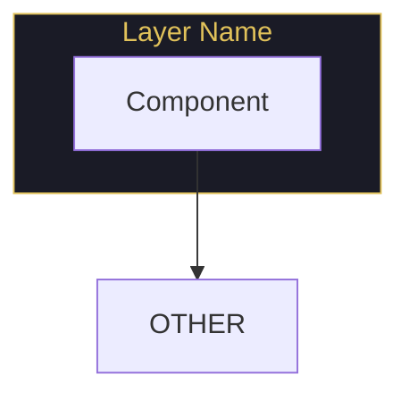

# Memory #30: PRD structure template from gentle-ai

**Type**: pattern  
**Created**: 2026-04-09 18:52:32  
**Project**: jarvis-dev  
**Scope**: project

---

**What**: Extracted PRD structure template from gentle-ai for use in jarvis-dev PRD

**Why**: To follow proven patterns for technical PRD writing (2,366 lines across 2 PRDs: main + agent-builder)

**Where**: /tmp/gentle-ai/PRD.md + PRD-AGENT-BUILDER.md

**Template Structure**:

## Main PRD Sections (in order)
1. **Problem Statement** — Current pain point, why existing solutions fail
2. **Vision** — One-sentence value prop + "Before/After" storytelling
3. **Target Users** — Primary (with use cases) + Secondary
4. **Supported Platforms** — OS/arch matrix with priority (P0/P1/P2)
5. **Prerequisites & Dependencies** — Exhaustive dependency matrix (always required vs conditionally required)
6. **Components to Install/Configure** — Feature breakdown with sub-sections per component
7. **User Experience** — Installation flow (ASCII diagram), TUI screens table, non-interactive mode
8. **Technical Architecture** — Mermaid diagrams (Big Picture, Runtime, Pipeline, Config Matrix)
9. **Component-Specific Behaviors** — Deep dive per major component (one section each)
10. **Success Criteria** — Measurable KPIs
11. **Non-Goals** — Explicit boundaries
12. **Open Questions** — Remaining decisions (if draft)
13. **Appendices** — Glossary, references, changelog

## Format Patterns

### Tables (heavy usage)
- **Feature matrices**: Components x Capabilities with checkmarks
- **Decision trees**: Scenario → Action with conditions
- **Requirement tracking**: R-XXX-01 IDs with description column
- **Platform notes**: OS x Behavior with special handling column
- **User flows**: Step x Screen x Action

### Mermaid Diagrams (4 in main PRD)


### Requirements Format
```markdown
**Requirements:**
- R-COMPONENT-01: The installer MUST {requirement}
- R-COMPONENT-02: The installer SHOULD {recommendation}
- R-COMPONENT-03: The installer MAY {optional feature}
```

### "Before/After" Storytelling
```markdown
**Before**: "{Current frustrating experience}"
**After**: `{one command}` → {Magical result} → {Benefit}
```

### ASCII User Flows
```
curl install.sh | sh
         │
         ▼
┌─────────────────┐
│   Step Name     │
│   Description   │
└────────┬────────┘
         │
    ┌────┴────┐
    │ Branch  │
    ▼         ▼
  Path A    Path B
```

## Content Guidelines

### DO
- Use tables for anything with 3+ columns of structured data
- Include Mermaid for architecture (1-2 diagrams minimum)
- Add "Before/After" storytelling in Problem Statement
- Track requirements with IDs (R-XXX-NN format)
- Explicit platform tables for macOS/Linux/Windows differences
- Include non-goals section
- Use RFC 2119 keywords (MUST, SHALL, SHOULD, MAY) in requirements

### DON'T
- Write walls of prose (use tables/diagrams)
- Skip non-goals (readers assume scope creep otherwise)
- Forget platform-specific notes (causes bug reports)
- Use vague success criteria (must be measurable)
- Mix problem statement with solution (separate sections)

## Recommended for jarvis-dev
- **Use this structure** but simplify: ~800 lines vs 1,400+
- **Keep**: Tables, Mermaid (1-2 diagrams), Requirements IDs, Before/After, Non-Goals
- **Add**: Workflow scenarios (Day in the Life), Progressive disclosure (basic → advanced)
- **Remove**: 8-agent complexity (jarvis-dev is personal env, not multi-agent installer)

**Learned**:
- gentle-ai PRD is exhaustive because it's enterprise-grade (8 agents, 5 platforms, 260+ tests)
- jarvis-dev should borrow FORMAT, not SCALE
- Tables >>> prose for technical PRDs
- Mermaid diagrams are non-negotiable for architecture sections
- Requirement IDs enable traceability (critical for large projects)
