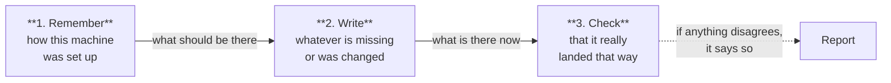

# What `jarvis sync` Does

`jarvis sync` puts your machine back the way the last installation left it, without asking you anything again.

That is the whole idea. It is not a new feature or a separate mode: it is the setup wizard, repeated from memory.

This page explains the command in plain language. For flags, exit codes, and the exact list of what is replayed, see [`docs/cli-reference.md`](../cli-reference.md). For error messages and what to do about them, see [`docs/troubleshooting.md`](../troubleshooting.md).

## The three steps



The order matters, and it is deliberate:

- Sync never writes before working out what should be there.
- Sync never trusts its own writing. It measures the result and compares.

If the result does not match, it tells you rather than reporting success.

## What it owns, and what stays yours

Jarvis manages instruction files for your agents, such as `CLAUDE.md` and `AGENTS.md`. Those files are also yours — you can write whatever you like in them.

Both things are true at once because Jarvis marks its own sections. Everything inside its markers belongs to Jarvis. Everything outside them is yours.

```text
CLAUDE.md
│
├─ <!-- JARVIS:LAYER1:START -->      ← Jarvis rewrites this,
│    your persona and your rules        and compares it afterwards
│  <!-- JARVIS:LAYER1:END -->
│
├─ ## My notes                       ← yours: never touched,
│    The client uses Postgres 14.        and never even compared
│
├─ <!-- jarvis:hive-protocol -->     ← Jarvis rewrites this,
│    skills and the memory protocol      and compares it afterwards
│  <!-- /jarvis:hive-protocol -->
│
└─ ## More of my notes               ← yours
```

The two halves go together. Sync only compares what it owns, because comparing the whole file would make any note of yours look like a permanent failure — a failure caused by content sync itself deliberately preserved.

## When to run it

| Situation | What sync does |
|---|---|
| You updated Jarvis | Brings your machine up to date with what the new version ships, keeping the choices you made during setup. |
| Something got deleted or modified | Puts it back, without you having to remember what was there. |
| Any time, out of habit | If everything is already in place, it writes nothing and tells you so. Running it more often than necessary costs nothing. |

## What it does not do

- **It asks you nothing.** To change your choices, run the setup wizard (`jarvis`), not sync.
- **It does not synchronize Hive memory.** The name invites the confusion, but sync only restores configuration. Memory data moves through the agent-facing `mem_sync` tool, and every sync report says so explicitly.
- **It does not delete what you wrote.** Neither your notes inside the managed files nor anything outside its markers.
- **It does not carry your setup to another machine.** Sync reads only this machine's record at `~/.jarvis/state.yaml`, and that record stores paths containing your own home directory. On a new laptop there is nothing to replay: run the normal installation there.
- **It does not guess.** With no record of a previous installation, it stops and says so rather than inventing a configuration.
- **It does not re-detect agents.** If sync keeps restoring an agent you no longer want, the record still lists it — use `jarvis config forget-agent <agent>`.

## The short version

Sync is your last installation, repeated from memory — carefully enough not to overwrite anything you wrote yourself.
